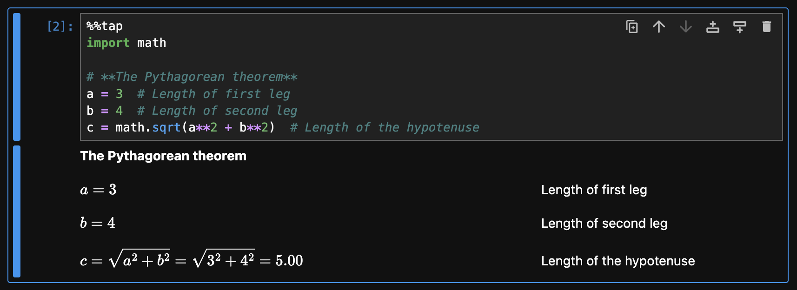

# Getting Started

Welcome to **Rubberize**! This guide will help you get started with using Rubberize in Jupyter Notebooks to render your calculations as beautifully typeset math.

> [!TIP]
> If you only plan to use Rubberize's functions in your scripts, you might want to go straight to the [API Reference](api_reference.md).

## Installation

To install Rubberize for Jupyter Notebooks, run the following command:

```bash
pip install rubberize[notebook]
```

Additionally, you need to install [Playwright](https://playwright.dev)'s headless Chromium dependency, which is required for the PDF export functionality:

```bash
playwright install chromium
```

## Before You Begin

Rubberize is designed for Jupyter Notebooks. To follow along with this guide:

1. Open a Jupyter Notebook.
2. Copy and paste the provided code examples into **separate** code cells.
3. Run each cell to see the results.

## Loading Rubberize

To load Rubberize in your notebook, import it and use the `%load_ext` line magic:

```python
import rubberize
%load_ext rubberize
```

Rubberize loads its *cell magic* commands and CSS stylesheet, enabling you to use it in subsequent cells. **You only need to do this once per notebook session.**

## Rendering Python Calculations

Use the `%%tap` cell magic command **at the first line** of a code cell to render the entire cell as typeset math. For example, paste the following into a cell and run it:

```python
%%tap
import math

# **The Pythagorean theorem**
a = 3  # Length of first leg
b = 4  # Length of second leg
c = math.sqrt(a**2 + b**2)  # Length of the hypotenuse
```

<picture>
    <source media="(prefers-color-scheme: dark)" srcset="assets/rendering_python_calculations_dark.png">
    <source media="(prefers-color-scheme: light)" srcset="assets/rendering_python_calculations.png">
    
</picture>


From the screenshot above, you can see the following:

- `import` statements are ignored.
- Comments are rendered as text, allowing you to add annotations or explanations directly in your code.
- The expression `math.sqrt(a**2 + b**2)` is displayed in mathematical notation, with the substitution of known values and the final result shown.

Simple, right?

## Formatting Annotations

Rubberize supports [Markdown](https://www.markdownguide.org/basic-syntax/) in comments. For example, the line:

```
# **The Pythagorean theorem**
```

is displayed as bold text, allowing you to format annotations directly within your code. In addition, Rubberize provides additional formatting options for comments, which are detailed below.

### Small text

Text enclosed in `^...^` syntax will appear smaller when rendered. This can be used to write secondary annotations:

```python
%%tap

```

- `\\`: Forces a line break within a line, which is useful for breaking inline annotations to multiple lines.

- `{{ ... }}`: Python code within comments. Rubberize will render the enclosed expression in math notation as well. Try this:

    ```python
    %%tap
    z = 210
    # We know {{ z }}, so twice of it is {{ 2 * z }}.
    ```

- An alert box similar to [GitHub's implementation](https://docs.github.com/en/get-started/writing-on-github/getting-started-with-writing-and-formatting-on-github/basic-writing-and-formatting-syntax#alerts):

    ```markdown
    > [!NOTE]
    > Some useful information you want to stand out.
    ```

    Valid alert box types are `!NOTE`, `!PASS`, `!WARNING`, and `!FAIL`

- A screen-only alert box, which are visible on screen but not included when the notebook is exported to PDF:

    ```markdown
    > [?NOTE]
    > Some useful information you want to stand out.
    ```

    Valid screen-only alert box types are `?NOTE`, `?PASS`, `?WARNING`, and `?FAIL`

- `!...`: When added to an inline comment, The LaTeX for the line of Python code is applied additional styling.

    Valid keywords are `!hi`,` !yhi`, `!rhi`, `!ghi`, and `!bhi` to highlight the rendered math expression. Moreover, `!mark` adds a thick vertical bar to the left of the expression.

- `?...`: Screen-only version of additional styling for lines of Python code.

    Valid keywords are `?hi`,` ?yhi`, `?rhi`, `?ghi`, and `?bhi` to highlight the rendered math expression. Moreover, `?mark` adds a thick vertical bar to the left of the expression.

## Configuring Rubberize

Rubberize allows you to customize how your code should be rendered by providing **`config` options** and **keywords**.

- **`config` Options**: These provide detailed control over Rubberize's behavior. For example:
    - `@use_symbols=True`: Whether to convert whole words as math symbols (e.g., `beta` $\mapsto$ $\beta$).
    - `@num_format_prec=2`: Sets the display precision of numbers.

- **Keywords**: These are shorthand for a single or set of configuration options. For example:
    - `@3`: Shorthand for `@num_format_prec=3`.
    - `@nosub`: Hides substitution and enables the display of definition and results of an expression. Shorthand for `@show_definition=True @show_substitution=False @show_result=True`.

In general, use **configuration options** for detailed control, and **keywords** for quick adjustments. For a full list of both, see the [Config Reference](config_reference.md).

### Changing the Configuration

Rubberize provides four ways to apply configuration options and keywords:

1. **By calling the `config` singleton**: Rubberize uses a singleton configuration object, which allows you to globally change the configuration. This method can only take `config` options and not keywords:

    ```python
    import rubberize

    rubberize.config.set(show_substitution=False)
    ```


### About the Configuration Singleton

The configuration system in Rubberize is managed by a *singleton* object, meaning there is only one instance of the configuration shared across your entire session. You can use the singleton to set global defaults or temporarily override settings.

## How Rubberize Interprets Code

Rubberize is designed to intelligently render different types of Python expressions and statements into beautifully formatted math and text. Whether you're working with mathematical formulas, loops, or conditionals, Rubberize ensures your code is presented clearly and effectively.

For a detailed explanation of how Rubberize handles specific types of expressions and statements, see the [Expression and Statement Rendering](expr_and_stmt_rendering.md) guide.

## Expression Display Modes

Rubberize renders a full math expression in three ways:

| Display Mode     | Description                                                                            | Rendered Output                      |
|------------------|----------------------------------------------------------------------------------------|--------------------------------------|
| **Definition**   | The base form of the expression, before substituting specific values.                  | $\displaystyle \sqrt{x^{2} + y^{2}}$ |
| **Substitution** | The expression after substituting numerical values for variables.                      | $\displaystyle \sqrt{3^{2} + 4^{2}}$ |
| **Result**       | The final calculated value of the expression after all operations are performed.       | $\displaystyle 5.00$                 |

By default, Rubberize generates **all three display modes**, arranging them as equalities on a single line.

### Managing the Display Modes

You can configure which display modes are included during rendering using either the following `config` option or *keyword*:

| Display Mode     | `config` Option           | Keyword to show/hide<br>only the display mode |
|------------------|---------------------------|-----------------------------------------------|
| **Definition**   | `@show_definition=True`   | `@def`/`@nodef`                               |
| **Substitution** | `@show_substitution=True` | `@sub`/`@nosub`                               |
| **Result**       | `@show_result=True`       | `@res`/`@nosub`                               |

Additionally, the keyword `@none` hides all display modes, while `@all` shows all display modes.

You can apply this in three ways.

> [!note]
> These methods are also how you apply other `config` options or keywords specified in the [Config Reference](config_reference.md).

- **Method 1: Passing as an Argument to `%%tap`**:

    ```python
    %%tap  @show_substitution=False
    c = math.sqrt(a**2 + b**2)
    d = a - b
     ```

- **Method 2: As a line comment:**

    ```python
    %%tap
    a * b
    # @def
    a + b
    a - b
    # @show_result=False
    a / b
    ```

    If done this way, the config set using this method will apply **to all subsequent lines** until the next line comment is encountered.

- **Method 3: As an inline comment.**

    ```python
    %%tap
    a + b
    a - b  # @nosub
    ```

    If done this way, the configuration will apply **only to the commented line**.

### Variables

### Conditional Blocks

### Function Definitions

### Function and Method Calls

<!--
    TODO:
        - Pint units
        - Variable naming
        - Other features and stylistic choices
        - Integrating with pint units
        - `CalcSheet` and `Table` classes
-->
