# Getting Started

Welcome to **Rubberize**! This guide will help you get started with using Rubberize in Jupyter Notebooks to render your calculations as beautifully typeset math.

> [!TIP]
> If you only plan to use Rubberize's functions in your scripts, you might want to go straight to the [API Reference](api_reference.md).

## Installation

To install Rubberize for Jupyter Notebooks, run the following command:

```bash
pip install rubberize[notebook]
```

Additionally, you need to install [Playwright](https://playwright.dev)'s headless Chromium dependency, which is required for the PDF export functionality:

```bash
playwright install chromium
```

## Before You Begin

Rubberize is designed for Jupyter Notebooks. To follow along with this guide:

1. Open a Jupyter Notebook.
2. Copy and paste the provided code examples into **separate** code cells.
3. Run each cell to see the results.

## Loading Rubberize

To load Rubberize in your notebook, import it and use the `%load_ext` line magic:

```python
import rubberize
%load_ext rubberize
```

Rubberize loads its *cell magic* commands and CSS stylesheet, enabling you to use it in subsequent cells. **You only need to do this once per notebook session.**

## Rendering Python Calculations

Use the `%%tap` cell magic command **at the first line** of a code cell to render the entire cell as typeset math. For example, paste the following into a cell and run it:

```python
%%tap
import math

# **The Pythagorean theorem**
a = 3  # Length of first leg
b = 4  # Length of second leg
c = math.sqrt(a**2 + b**2)  # Length of the hypotenuse
```

<picture>
    <source media="(prefers-color-scheme: dark)" srcset="assets/getting_started/rendering_python_calculations_dark.png">
    <source media="(prefers-color-scheme: light)" srcset="assets/getting_started/rendering_python_calculations.png">
    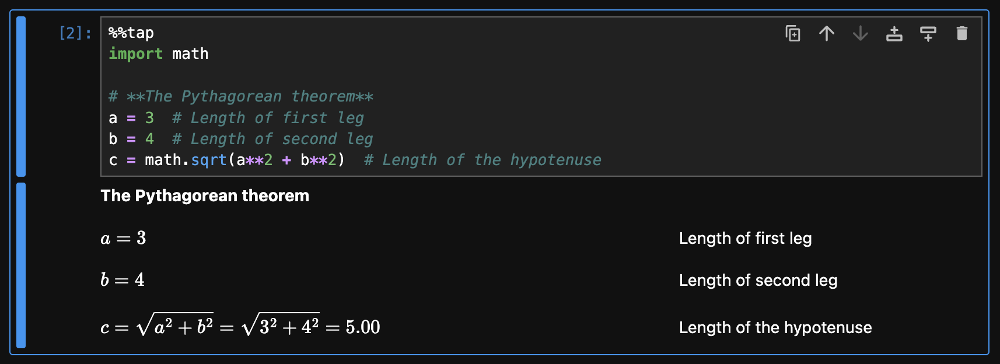
</picture>


From the screenshot above, you can see the following:

- `import` statements are ignored.
- Comments are rendered as text, allowing you to add annotations or explanations directly in your code.
- The expression `math.sqrt(a**2 + b**2)` is displayed in mathematical notation, with the substitution of known values and the final result shown.

Rubberize can render different types of Python expressions and statements into beautifully formatted math and text. Whether you're working with mathematical formulas, loops, or conditionals, Rubberize ensures your code is presented clearly and effectively.

To see how Rubberize handles specific types of expressions and statements, see the [Expression and Statement Rendering](rendering/index.md) guide.

### Dead Cells

Use the `%%tap --dead` option to mark a cell as non-executable. Dead cells are rendered **but not executed**, allowing you to transform any valid syntax (but not necessarily runnable code) into an equation.

```python
%%tap --dead
y = m * x + b  # Slope-intercept form of a linear equation
```

<picture>
    <source media="(prefers-color-scheme: dark)" srcset="assets/getting_started/dead_cell_dark.png">
    <source media="(prefers-color-scheme: light)" srcset="assets/getting_started/dead_cell.png">
    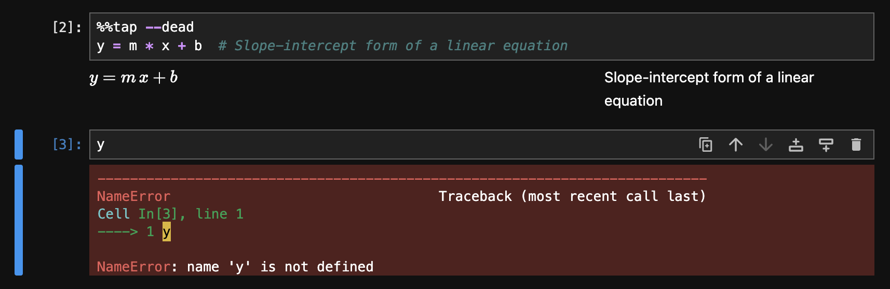
</picture>

This is particularly useful for presenting theoretical concepts, incomplete code snippets, or equations that don't require execution.

## Formatting Annotations

Rubberize supports [Markdown](https://www.markdownguide.org/basic-syntax/) in comments. Markdown allows you to format annotations directly within your code. Rubberize also provides these additional formatting syntaxes:

```python
%%tap
# ## Formatting Annotations
#
# - Markdown can be used to add **bold**, *italic*, <del>deleted</del> text, etc.
# - Use carets for ^smaller text^
# - Use double backslashes to \\ break a text into lines.
# - Use double braces {{ 6 + (4 * 2**3 -10) / 2 }} to Rubberize code within comments
```

<picture>
    <source media="(prefers-color-scheme: dark)" srcset="assets/getting_started/formatting_annotations_dark.png">
    <source media="(prefers-color-scheme: light)" srcset="assets/getting_started/formatting_annotations.png">
    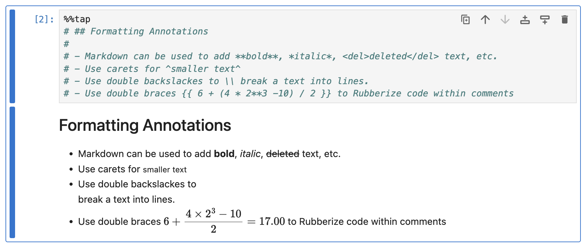
</picture>

Rubberize also supports alert boxes similar to GitHub's implementation and syntax to mark or highlight the rendered math expressions. See [Advanced Formatting](advanced_formatting.md) guide to learn about them.

## Units

Scientists and engineers often work with physical quantities, which have *units*. Rubberize simplifies unit-aware calculations by integrating with [Pint](https://github.com/hgrecco/pint), which keeps track of physical quantities for you.

> [!NOTE]
> Pint is not a core dependency of `rubberize[notebook]`. If you want to work with units, you have to install it with:
> ```bash
> pip install pint
> ```

```python
%%tap
import numpy as np

# **The Pythagorean theorem**
a = 3.0 * ureg.cm  # Length of first leg
b = 4.0 * ureg.cm  # Length of second leg
c = np.sqrt(a**2 + b**2)  # Length of the hypotenuse
```

<picture>
    <source media="(prefers-color-scheme: dark)" srcset="assets/getting_started/units_dark.png">
    <source media="(prefers-color-scheme: light)" srcset="assets/getting_started/units.png">
    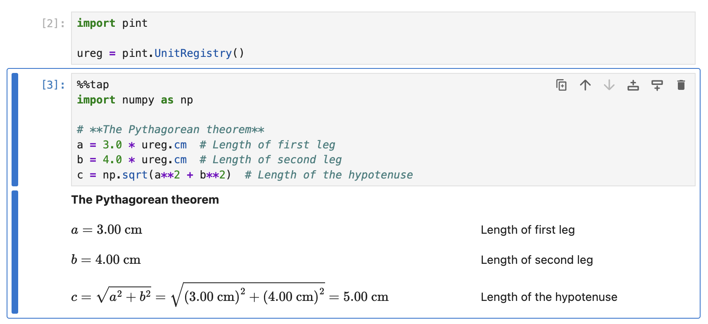
</picture>

## Calculation Sheets

In engineering reports, computed values are often compared against allowable limits to determine if a design is safe. Rubberize provides the `CalcSheet` class to aid users in creating reports by managing these comparisons, keeping the metadata for the calculation, and providing a formatted title heading.

When starting a calculation for a component analysis, instantiate a `CalcSheet` with at least a name and section number. Adding `%%tap` with the instantiation will transform it into a calculation sheet heading:

```python
%%tap
sheet = rubberize.CalcSheet(
    "1.01",
    "beam",
    project="ACME Building, Baguio City",
    system="General Framing System",
    calc_type="load capacity analysis",
    material="aluminum",
    references=[
        "ANSI/AISC 360-16. *Specification for Structural Steel Buildings*.",
    ]
)
```

<picture>
    <source media="(prefers-color-scheme: dark)" srcset="assets/getting_started/calc_sheet_dark.png">
    <source media="(prefers-color-scheme: light)" srcset="assets/getting_started/calc_sheet.png">
    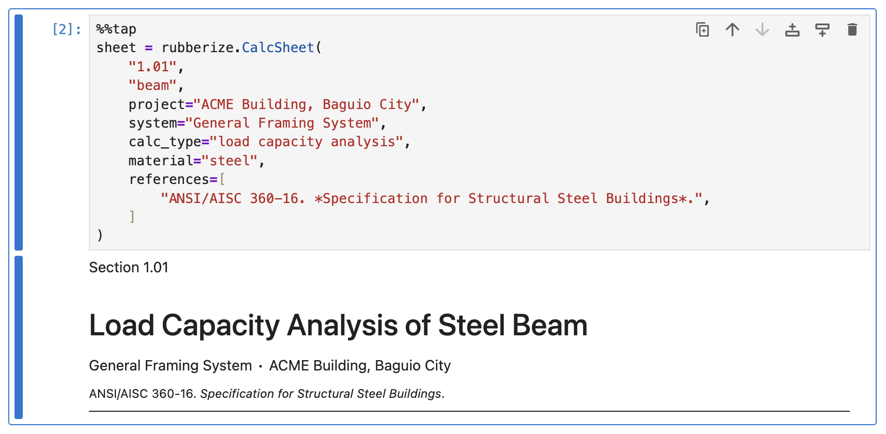
</picture>

In subsequent cells, when you need to record a comparison, use the `check()` method of the `CalcSheet` object. This allows you to log a labeled comparison between computed and allowable values.

```
%%tap
phi_b = 0.90 # Resistance factor
M_n  # Nominal flexural strength
M_r  # Required flexural strength
sheet.check("flexural strength", M_r, phi_b * M_n)
```

<picture>
    <source media="(prefers-color-scheme: dark)" srcset="assets/getting_started/calc_sheet_check_dark.png">
    <source media="(prefers-color-scheme: light)" srcset="assets/getting_started/calc_sheet_check.png">
    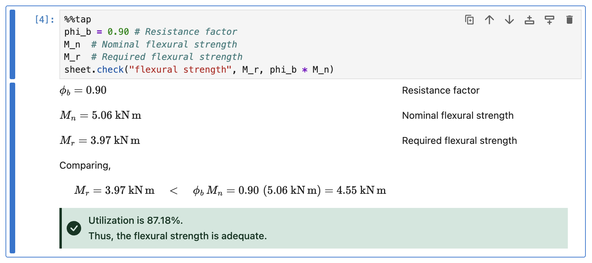
</picture>

Finally, when you're ready to determine whether the component being analyzed is safe, call the `conclude()` method. This automatically updates the conclusion based on all recorded comparisons.

```
%%tap
sheet.conclude(each_check=True)
```

<picture>
    <source media="(prefers-color-scheme: dark)" srcset="assets/getting_started/calc_sheet_conclude_dark.png">
    <source media="(prefers-color-scheme: light)" srcset="assets/getting_started/calc_sheet_conclude.png">
    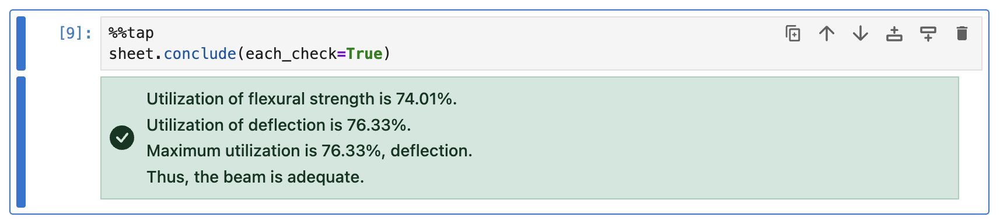
</picture>

## Tables

Normally, you would use a Pandas dataframe or another method to manipulate and present large tabular data in Rubberize.

If you want to render a table within a cell with `%%tap` activated, you can use the `Table` class:

```python
%%tap
al__strengths = rubberize.Table(
    al__strengths_data,
    col_headers = [
        r"$F_{\mathrm{tu}}$",
        r"$F_{\mathrm{ty}}$",
        r"$F_{\mathrm{tuw}}$",
        r"$F_{\mathrm{tyw}}$",
    ],
    row_headers = ["6061-T6", "6063-T5", "6063-T6"]
)
```

<picture>
    <source media="(prefers-color-scheme: dark)" srcset="assets/getting_started/table_dark.png">
    <source media="(prefers-color-scheme: light)" srcset="assets/getting_started/table.png">
    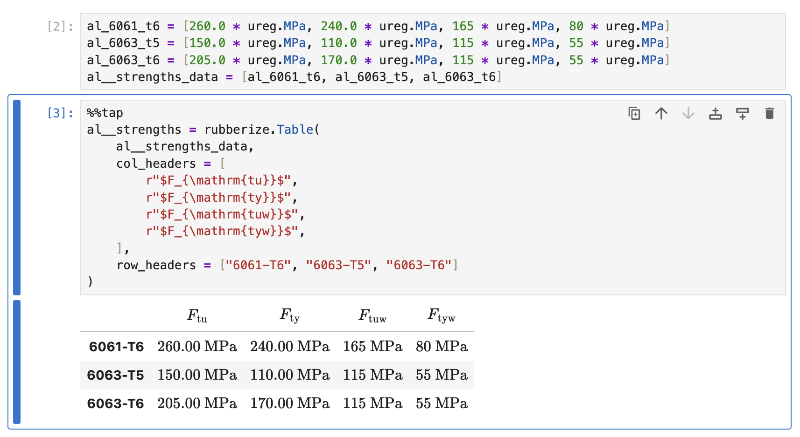
</picture>

## Customizing Rubberize

Rubberize allows you to customize how your code should be rendered by providing *`config` options* and *keywords* prefixed by `@`.

- **`config` Options** take values to provide detailed control over Rubberize's behavior. For example:

    | `config` Option    | Type   | Purpose                                                                       |
    |--------------------|--------|-------------------------------------------------------------------------------|
    | `@use_symbols`     | `bool` | Whether to convert whole words as math symbols (e.g., `beta` &rarr; $\beta$). |
    | `@num_format_prec` | `int`  | Sets the display precision of numbers.                                        |

- **Keywords**: These are single names that are shorthand for one or more configuration options. For example:

    | Keyword  | Purpose                                                                                                                                                                        |
    |----------|--------------------------------------------------------------------------------------------------------------------------------------------------------------------------------|
    | `@3`     | The number of decimal places to display for numeric results. Same as `@num_format_prec=3`.                                                                                     |
    | `@nosub` | Hides *substitution* and enables the display of *definition* and *results* of an expression. Shorthand for `@show_definition=True @show_substitution=False @show_result=True`. |

In general, use **configuration options** for detailed control, and **keywords** for quick adjustments.

See the [Config Reference](config_reference.md) to learn more about all available configuration.

### Changing the Configuration

There are four ways to apply configuration options and keywords:

1. **By calling `config.set()`:** The method allows you to change the configuration **for the entire session**. This method can only take *`config` options* without an `@` prefix:

    ```python
    import rubberize

    rubberize.config.set(multiline=True, wrap_indices=False)
    ```

    To reset the modified `config` option:

    ```python
    rubberize.config.reset("show_substitution")
    ```

2. **By passing the configuration as an argument to `%%tap`:** This approach allows you to change the configure **for all lines in the cell**.

    ```python
    %%tap  @use_symbols=False
    omega_b = 1.67
    ```

    <picture>
    <source media="(prefers-color-scheme: dark)" srcset="assets/getting_started/config_tap_argument_dark.png">
    <source media="(prefers-color-scheme: light)" srcset="assets/getting_started/config_tap_argument.png">
    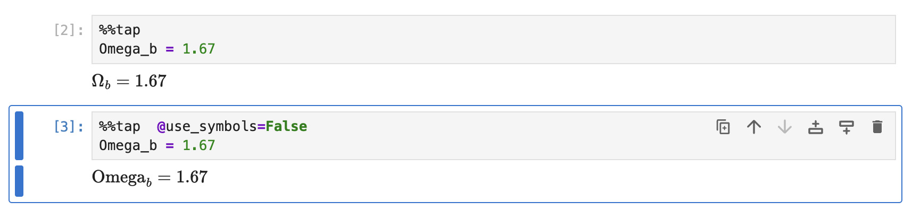
    </picture>

3. **By adding to an inline comment:** This approach allows you to change the configuration **for the the line of code only**. Other lines will not be affected.

    ```python
    %%tap
    apples__total = 104
    n_b = 12  # @0 Number of students in class
    apples_b = apples__total // n_b  # Number of apples per student
    ```

    <picture>
    <source media="(prefers-color-scheme: dark)" srcset="assets/getting_started/config_inline_comment_dark.png">
    <source media="(prefers-color-scheme: light)" srcset="assets/getting_started/config_inline_comment.png">
    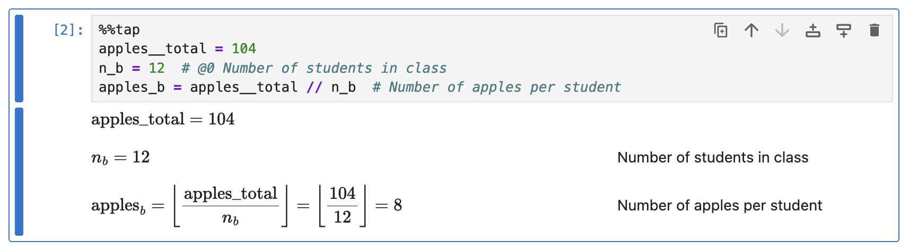
    </picture>

4. **By adding to a line comment:** The configuration set using this method will apply **to all subsequent lines**, until the next line comment is encountered.

    ```python
    %%tap
    # @use_subscripts=False Variables are not subscripted
    p_a = 1
    p_b = (2, 3)

    # Config is reset after a new line comment
    p_c = [4, 5, 6]
    p_d = 7
    ```

    <picture>
    <source media="(prefers-color-scheme: dark)" srcset="assets/getting_started/config_line_comment_dark.png">
    <source media="(prefers-color-scheme: light)" srcset="assets/getting_started/config_line_comment.png">
    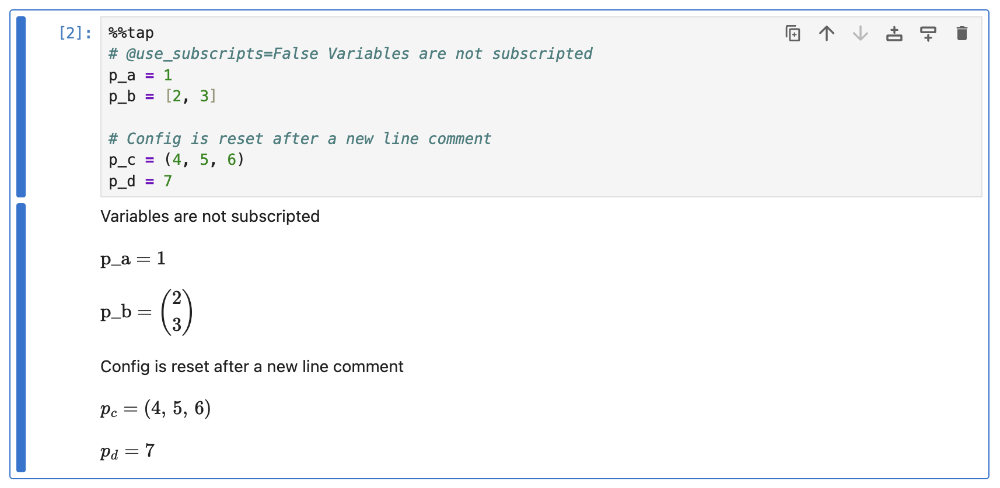
    </picture>

## Exporting to PDF

Rubberize allows you to export your Jupyter Notebook to a PDF file for technical reports. The exported PDF preserves rendered math and annotations for a polished presentation.

To export a single notebook to PDF, use the `export_notebook_to_pdf()` function in a module or a new notebook:

```python
from rubberize import export_notebook_to_pdf

export_notebook_to_pdf("path/to/notebook.ipynb")
```

This will generate a PDF file in the same directory as the notebook. You can specify an output file by passing `output=path/to/output/` as a function argument.

By default, input cells are excluded in the PDF. To include them, pass `no_input=False` as a function argument.

### Exporting Multiple Notebooks

If you have a directory containing multiple notebooks, you can export all of them to PDF as once:

```python
export_notebook_to_pdf("path/to/notebooks_directory")
```

The PDFs will be saved in a new directory named `<directory_name>_pdf` in the same location as the input directory.

## What's Next?

- [Expression and Statement Rendering](rendering/index.md): Read about what various Python expressions and statements look like when transformed by Rubberize.
- [Advanced Formatting](advanced_formatting.md): Learn more about formatting options for annotations.
- [Config Reference](config_reference.md): See all available configuration options and keywords.
