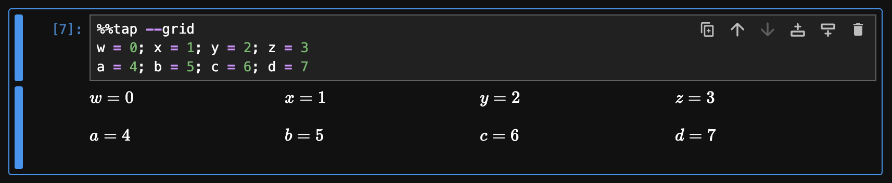
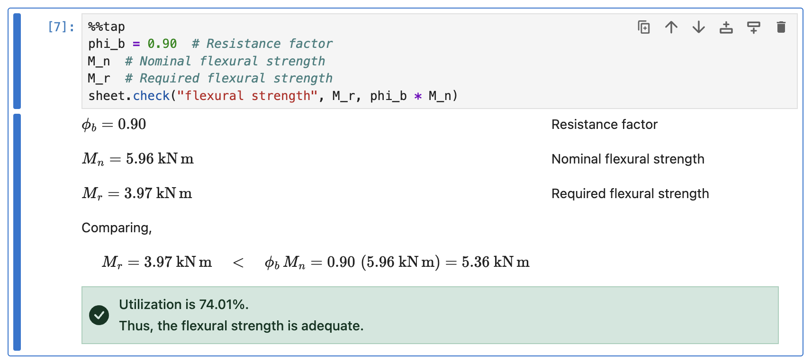

# Getting Started

Welcome to **Rubberize**! This guide will help you get started with using Rubberize in Jupyter Notebooks to render your calculations as beautifully typeset math.

> [!TIP]
> If you only plan to use Rubberize's functions in your scripts, you might want to go straight to the TODO [API Reference](api_reference.md).

## Installation

To install Rubberize and include dependencies that allow it to be used with Jupyter Notebooks:

```bash
pip install rubberize[notebook]
```

## Before You Begin

Rubberize is designed for Jupyter Notebooks. To follow along with this guide:

1. Open a Jupyter Notebook.
2. Copy and paste the provided code examples into **separate** code cells.
3. Run each cell to see the results.

## Loading Rubberize

To load Rubberize in your notebook, use the `%load_ext` line magic:

```python
%load_ext rubberize
```

## Rendering Python Calculations

Use the `%%tap` cell magic command **at the first line** of a code cell to render the entire cell as typeset math:

```python
%%tap
import math

# **The Pythagorean theorem**
a = 3  # Length of first leg
b = 4  # Length of second leg
c = math.sqrt(a**2 + b**2)  # Length of the hypotenuse
```

<picture>
    <source media="(prefers-color-scheme: dark)" srcset="assets/getting_started/rendering_python_calculations_dark.png">
    <source media="(prefers-color-scheme: light)" srcset="assets/getting_started/rendering_python_calculations.png">
    
</picture>

From the screenshot above, you can see the following:

- `import` statements are ignored.
- Comments are rendered as text annotations.
- The expression `math.sqrt(a**2 + b**2)` is displayed in mathematical notation, with the substitution of known values and the final result shown.

Rubberize can render different types of Python expressions and statements into mathematical notation. For a breakdown on how specific constructs are handled, see the [Expression and Statement Rendering](rendering/index.md) guide.

### Grid Mode

Use the `--grid` flag (or `-g` for short) with `%%tap` to arrange statements in an N&times;4 grid. Note that all annotations are ignored in this mode.

```python
%%tap --grid
w = 0; x = 1; y = 2; z = 3
a = 4; b = 5; c = 6; d = 7
```

<picture>
    <source media="(prefers-color-scheme: dark)" srcset="assets/getting_started/grid_cell_dark.png">
    <source media="(prefers-color-scheme: light)" srcset="assets/getting_started/grid_cell.png">
    
</picture>

### Dead Mode

Use the `--dead` flag with `%%tap` to suppress evaluation while still rendering the cell. This lets you transform any valid Python syntax&mdash;including code that isn't runnable, such as expressions with unbound variables&mdash;into mathematical notation.

```python
%%tap --dead
y = m * x + b  # Slope-intercept form of a linear equation
```

<picture>
    <source media="(prefers-color-scheme: dark)" srcset="assets/getting_started/dead_cell_dark.png">
    <source media="(prefers-color-scheme: light)" srcset="assets/getting_started/dead_cell.png">
    
</picture>

### Getting the Output Source

Use the `--html` flag with `%%tap` to get the HTML source of the cell output. This is useful for inspecting the generated markup or integrating the output into external tools or documents.

### Rendering and Loading Snippets

The line magic `%tapload` behaves like Jupyter's built in `%load`, but `%%tap` is added on the cell's first line. More info when you enter `%tapload?`.

A Notebook encoded in the `py:percent` [format](https://jupytext.readthedocs.io/en/latest/formats-scripts.html#the-percent-format) can also be loaded across multiple `%%tap` cells using `%taploads`. More info when you enter `%taploads?`.

## Formatting Annotations

Rubberize supports Markdown in comments so that you can style your text annotations. Rubberize also provides these additional formatting syntaxes:

```python
%%tap
# ## Formatting Annotations
#
# - Markdown can be used to add **bold**, *italic*, <del>deleted</del> text, etc.
# - Use carets for ^smaller text^
# - Use double backslashes to \\ break a text into lines.
# - Use double braces {{ 6 + (4 * 2**3 -10) / 2 }} to Rubberize code within comments
```

<picture>
    <source media="(prefers-color-scheme: dark)" srcset="assets/getting_started/formatting_annotations_dark.png">
    <source media="(prefers-color-scheme: light)" srcset="assets/getting_started/formatting_annotations.png">
    
</picture>

Rubberize also supports alert boxes similar to GitHub's implementation and syntax to mark or highlight the rendered math expressions. See TODO [Annotation Formatting](advanced_formatting.md) guide to learn about them.

## Units

Scientists and engineers often work with physical quantities&mdash;numbers that carry units. Rubberize simplifies unit-aware calculations by integrating with [Pint](https://github.com/hgrecco/pint), which automatically tracks and manages these quantities.

> [!NOTE]
> Pint is not a core Rubberize dependency. You will need to install it separately. Refer to the [Pint documentation](https://pint.readthedocs.io) for details.

```python
%%tap
import numpy as np

# **The Pythagorean theorem**
a = 3.0 * ureg.cm  # Length of first leg
b = 4.0 * ureg.cm  # Length of second leg
c = np.sqrt(a**2 + b**2)  # Length of the hypotenuse
```

<picture>
    <source media="(prefers-color-scheme: dark)" srcset="assets/getting_started/units_dark.png">
    <source media="(prefers-color-scheme: light)" srcset="assets/getting_started/units.png">
    
</picture>

## Calculation Sheets

In engineering reports, computed values are often compared against allowable limits to determine if a design is safe. Rubberize provides the `CalcSheet` class to help organize these comparisons, manage related metadata, and generate a properly formatted heading for each calculation section.

To begin a calculation (such as for a component analysis), create a `CalcSheet` instance with at least a section number and a name. Using `%%tap` with the instantiation transforms it into a styled heading for your report:

```python
%%tap
sheet = rubberize.CalcSheet(
    "1.01",
    "beam",
    project="ACME Building, Baguio City",
    system="General Framing System",
    calc_type="load capacity analysis",
    material="steel",
    references=[
        "ANSI/AISC 360-16. *Specification for Structural Steel Buildings*.",
    ]
)
```

<picture>
    <source media="(prefers-color-scheme: dark)" srcset="assets/getting_started/calc_sheet_dark.png">
    <source media="(prefers-color-scheme: light)" srcset="assets/getting_started/calc_sheet.png">
    
</picture>

In the subsequent cells, when you need to record a comparison, use the `check()` method of the `CalcSheet` object. This allows you to log a labeled comparison between computed and allowable values.

```
%%tap
phi_b = 0.90 # Resistance factor
M_n  # Nominal flexural strength
M_r  # Required flexural strength
sheet.check("flexural strength", M_r, phi_b * M_n)
```

<picture>
    <source media="(prefers-color-scheme: dark)" srcset="assets/getting_started/calc_sheet_check_dark.png">
    <source media="(prefers-color-scheme: light)" srcset="assets/getting_started/calc_sheet_check.png">
    
</picture>

Finally, when you're ready to determine whether the component being analyzed is safe, call the `conclude()` method. This automatically renders the conclusion based on all recorded comparisons.

```
%%tap
sheet.conclude(each_check=True)
```

<picture>
    <source media="(prefers-color-scheme: dark)" srcset="assets/getting_started/calc_sheet_conclude_dark.png">
    <source media="(prefers-color-scheme: light)" srcset="assets/getting_started/calc_sheet_conclude.png">
    
</picture>

## Customizing Rubberize

Rubberize's rendering behavior can be customized using two mechanisms: **Config Options** and **Keywords**

- **Config Options** are settings that take values, giving you fine-grained control over how rubberize renders your code. For example:

    | `config` Option    | Type   | Purpose                                                                       |
    |--------------------|--------|-------------------------------------------------------------------------------|
    | `@use_symbols`     | `bool` | Whether to convert whole words as math symbols (e.g., `beta` &rarr; $\beta$). |
    | `@num_format_prec` | `int`  | Sets the display precision of numbers.                                        |

- **Keywords** are shorthand names that represent one or more Config Options, allowing quick adjustments. For example:

    | Keyword  | Purpose                                                                                                                                                                        |
    |----------|--------------------------------------------------------------------------------------------------------------------------------------------------------------------------------|
    | `@3`     | The number of decimal places to display for numeric results. Same as `@num_format_prec=3`.                                                                                     |
    | `@nosub` | Hides *substitution* and enables the display of *definition* and *results* of an expression. Shorthand for `@show_definition=True @show_substitution=False @show_result=True`. |

Use Config Options when you need precise control, and Keywords for quick, common adjustments.

See the [Config Reference](config_reference.md) to learn more about all available Config Options and Keywords.

### Applying Customizations

There are four ways to apply Config Options and Keywords:

1. **By passing Config Options as arguments to `config.set()`:** The method allows you to change the configuration **for the entire notebook session**. This method can only take Config Options without the `@` prefix:

    ```python
    rubberize.config.set(multiline=True, wrap_indices=False)
    ```

    To reset the modified Config Option to defaults:

    ```python
    rubberize.config.reset("multiline", "wrap_indices")
    ```

2. **By passing Config Options and Keywords as arguments to `%%tap`:** This approach allows you to apply changes to **all lines in the rendered cell**.

    ```python
    %%tap  @use_symbols=False
    omega_b = 1.67  # ASD
    phi_b = 0.90  # LRFD
    ```

    > [!NOTE]
    > For Config Options that take sets, wrap the set in quotes to avoid syntax errors:
    > ```python
    > %%tap @greek_starts='{"pi","nu"}'
    > ...
    > ```

3. **By adding Config Options and Keywords to an inline comment:** This approach allows you to customize **a single line of code**. Other lines will not be affected.

    ```python
    %%tap
    omega_b = 1.67  # @use_symbols=False ASD
    phi_b = 0.90  # LRFD
    ```

4. **By adding Config Options and Keywords to a line comment:** This approach allows you to apply customization **to all subsequent lines of code**, until the next line comment is encountered.

    ```python
    %%tap
    # @use_subscripts=False Variables are not subscripted
    p_a = 1
    p_b = (2, 3)

    # Config is reset after a new line comment
    p_c = [4, 5, 6]
    p_d = 7
    ```

    <picture>
    <source media="(prefers-color-scheme: dark)" srcset="assets/getting_started/config_line_comment_dark.png">
    <source media="(prefers-color-scheme: light)" srcset="assets/getting_started/config_line_comment.png">
    
    </picture>

## Exporting to PDF

Rubberize lets you export your Jupyter Notebook as a polished PDF report using `jupyter nbconvert --to webpdf`. You will need to install [Playwright](https://playwright.dev)'s headless Chromium dependency, which is required for web PDF exporting:

```bash
playwright install chromium
```

To export a single notebook to PDF, use the `export_notebook_to_pdf()` function from a separate notebook or script:

```python
from rubberize import export_notebook_to_pdf

export_notebook_to_pdf("path/to/notebook.ipynb")
```

This will generate a PDF file in the same directory as the notebook. You can specify an output file by passing `output="path/to/output/"` as an argument.

By default, input cells are excluded in the PDF. To include them, pass `no_input=False` as an argument.

### Exporting Multiple Notebooks

If you have a directory containing multiple notebooks, you can export all of them to separate PDF files at once:

```python
export_notebook_to_pdf("path/to/notebooks_directory")
```

The PDFs will be saved in a new directory named `<directory_name>_pdf` in the same location as the input directory.

### Using Line Magic

For convenience, the `%export` line magic is provided to run exports directly from inside a notebook. It wraps the same export functions but gives you a shorthand command. More info when you enter `%export?`.

> [!note]
> **Windows limitation:** `%export` behaves unexpectedly on Jupyter Lab installed on Windows. Please run the export functions directly from Python scripts instead.

## What's Next?

- [Expression and Statement Rendering](rendering/index.md): Read about what various Python expressions and statements look like when transformed by Rubberize.
- [Advanced Formatting](advanced_formatting.md): Learn more about formatting options for annotations.
- [Config Reference](config_reference.md): See all available configuration options and keywords.
