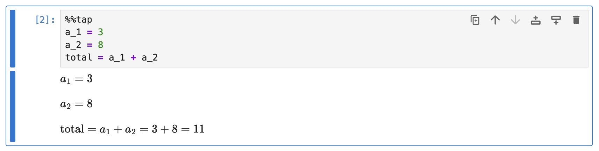
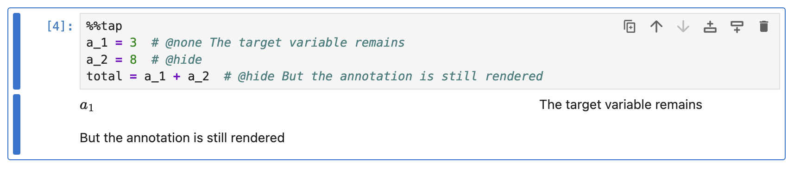
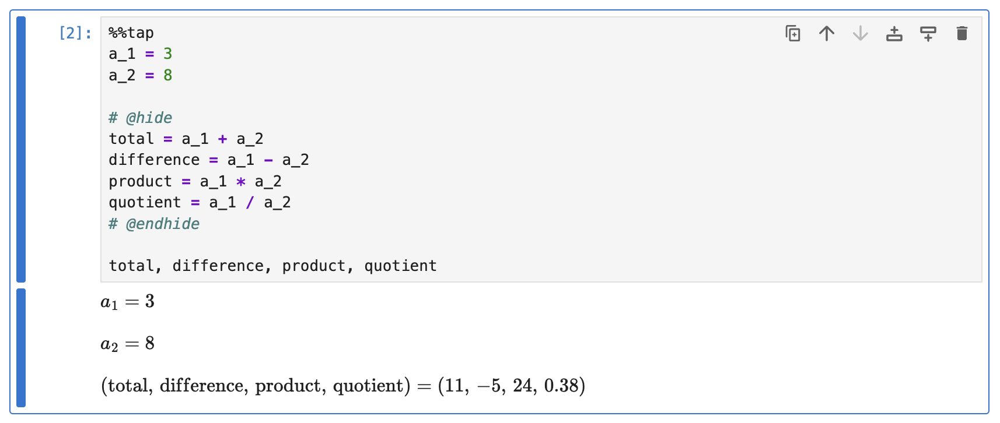
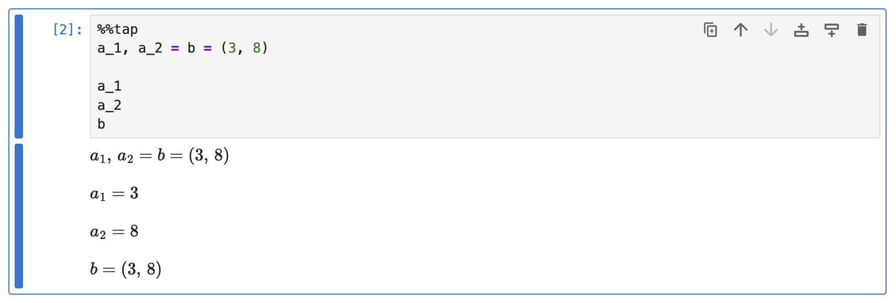
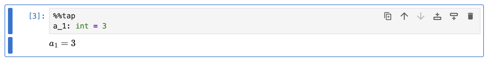

# Assignments

This guide demonstrates how Rubberize renders assignments.

Simple variable assignments are rendered as such:

```python
%%tap
a_1 = 3
a_2 = 8
total = a_1 + a_2
```

<picture>
    <source media="(prefers-color-scheme: dark)" srcset="../assets/rendering/assignments/assignment_dark.png">
    <source media="(prefers-color-scheme: light)" srcset="../assets/rendering/assignments/assignment.png">
    
</picture>

## Assignments of Physical Quantities

Units-aware calculation using [Pint](https://pint.readthedocs.io/en/stable/index.html) is supported by Rubberize:

```python
%%tap
v_1 = 0.0  # Final velocity of the car
v_0 = 25.0 * (ureg.m / ureg.s)  # Initial velocity of the car
t = 0.2 * ureg.s  # Time for the change in velocity
a = (v_1 - v_o) / t  # Deceleration of the car
m = 1_500.0 * ureg.kg  # Mass of the car
F = (m * a).to(ureg.kN)  # Average force experienced by the car in the crash
```

<picture>
    <source media="(prefers-color-scheme: dark)" srcset="../assets/rendering/pint/pint_dark.png">
    <source media="(prefers-color-scheme: light)" srcset="../assets/rendering/pint/pint.png">
    
</picture>

You can read more about it in the [Physical Quantities](pint.md) guide

## Hiding Assignments

If you use `@none` to hide all display modes of the expression or value being assigned to the target variable, you will be left with a rendering of the target variable. To hide the whole line you would need to use the `@hide` keyword:

```python
%%tap
a_1 = 3  # @none The target variable remains
a_2 = 8  # @hide
total = a_1 + a_2  # @hide But the annotation is still rendered
```

<picture>
    <source media="(prefers-color-scheme: dark)" srcset="../assets/rendering/assignments/hidden_assignment_dark.png">
    <source media="(prefers-color-scheme: light)" srcset="../assets/rendering/assignments/hidden_assignment.png">
    
</picture>

> [!Note]
> The code is still run. On subsequent code cells you can still access the assigned variables.

## Hiding Multiple Lines

To hide multiple lines, use the `@hide` keyword as a **line comment**. Subsequent lines are hidden until you use the `@endhide` keyword as a line comment:

```python
%%tap
a_1 = 3
a_2 = 8

# @hide
total = a_1 + a_2
difference = a_1 - a_2
product = a_1 * a_2
quotient = a_1 / a_2
# @endhide

total, difference, product, quotient
```

<picture>
    <source media="(prefers-color-scheme: dark)" srcset="../assets/rendering/assignments/hidden_block_dark.png">
    <source media="(prefers-color-scheme: light)" srcset="../assets/rendering/assignments/hidden_block.png">
    
</picture>

## Multiple Targets

Assignment to multiple targets is supported:

```python
%%tap
a_1, a_2 = b = (3, 8)

a_1
a_2
b
```

<picture>
    <source media="(prefers-color-scheme: dark)" srcset="../assets/rendering/assignments/multiple_assignment_dark.png">
    <source media="(prefers-color-scheme: light)" srcset="../assets/rendering/assignments/multiple_assignment.png">
    
</picture>

## Annotated Assignments

If you use type hints in your assignment, the type annotation will simply be ignored and not rendered:

```python
%%tap
a_1: int = 3
```

<picture>
    <source media="(prefers-color-scheme: dark)" srcset="../assets/rendering/assignments/annassign_dark.png">
    <source media="(prefers-color-scheme: light)" srcset="../assets/rendering/assignments/annassign.png">
    
</picture>

## What's Next?

Go back to [Expression and Statement Rendering](index.md) index to look at how other elements are rendered.