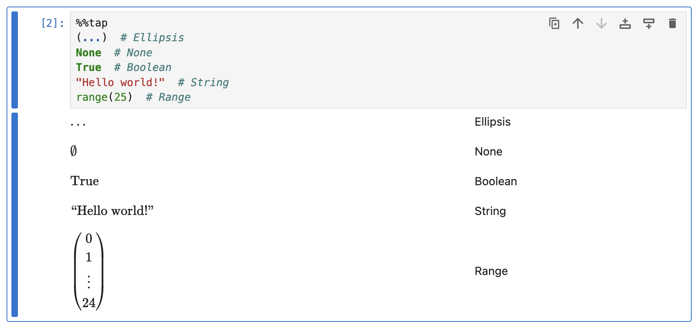

# Other Built-in Types

Built-in Python types other than [numbers](numbers.md) and [collections](collections.md) are rendered like so:

```python
%%tap
(...)  # Ellipsis
None  # None
True  # Boolean
"Hello world!"  # String
range(25)  # Range
```

<picture>
    <source media="(prefers-color-scheme: dark)" srcset="../assets/rendering/builtins/other_builtins_dark.png">
    <source media="(prefers-color-scheme: light)" srcset="../assets/rendering/builtins/other_builtins.png">
    
</picture>

### String Font Style

The font style for strings can be changed using the `@str_font` config option (a `str`, default is `""`) using the following options:

| Font style | `@str_font=` | Rendered Output           |
|------------|--------------|---------------------------|
| (default)  | `""`         | $\text{“Hello world!”}$   |
| Boldface   | `"bf"`       | $\textbf{“Hello world!”}$ |
| Italics    | `"it"`       | $\textit{“Hello world!”}$ |
| Roman      | `"rm"`       | $\textrm{“Hello world!”}$ |
| Sans serif | `"sf"`       | $\textsf{“Hello world!”}$ |
| Typewriter | `"tt"`       | $\texttt{“Hello world!”}$ |

## What's Next?

* Go to [Custom Types](custom_types.md) to learn how to create and register a converter for your custom object type.
* Go back to [Expression and Statement Rendering](index.md) index to look at how other elements are rendered.