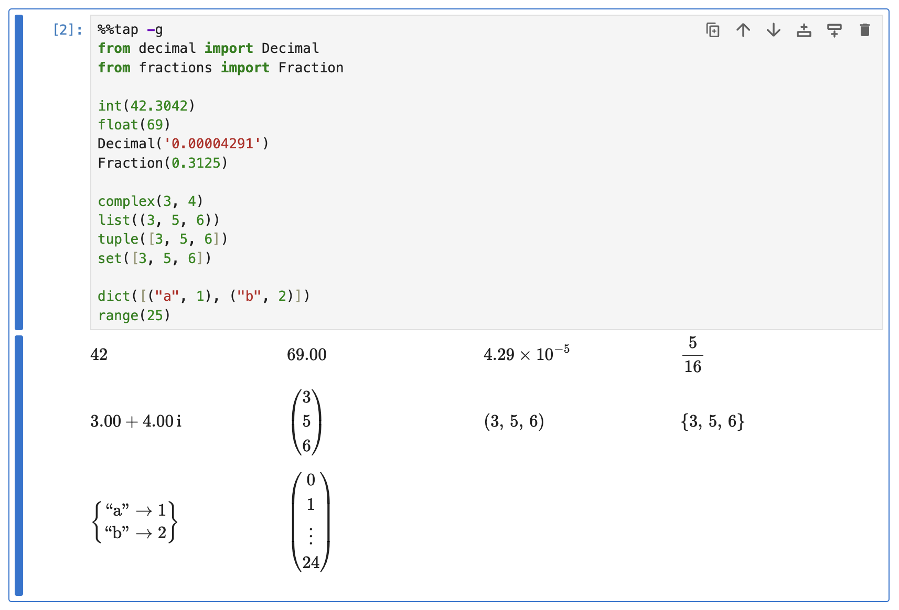
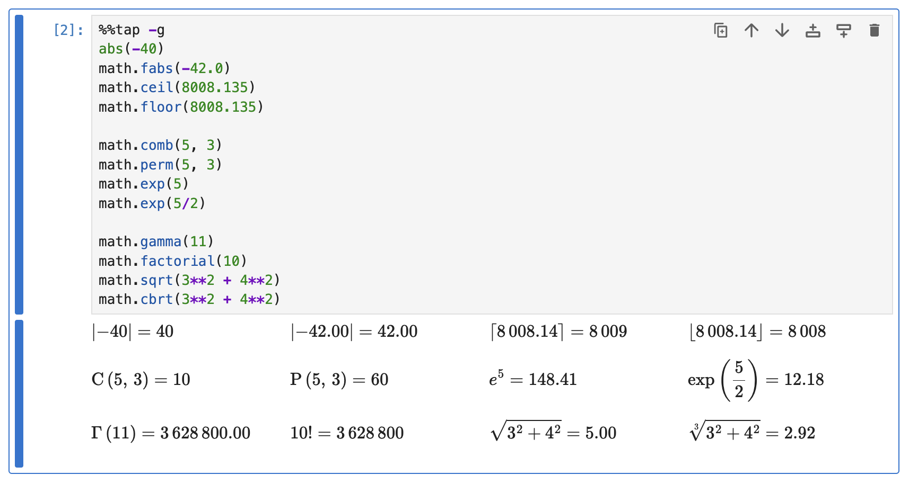
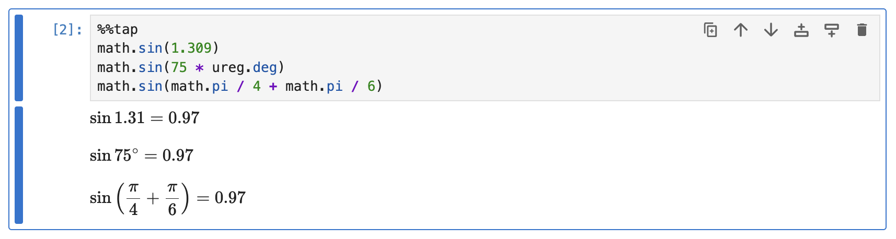
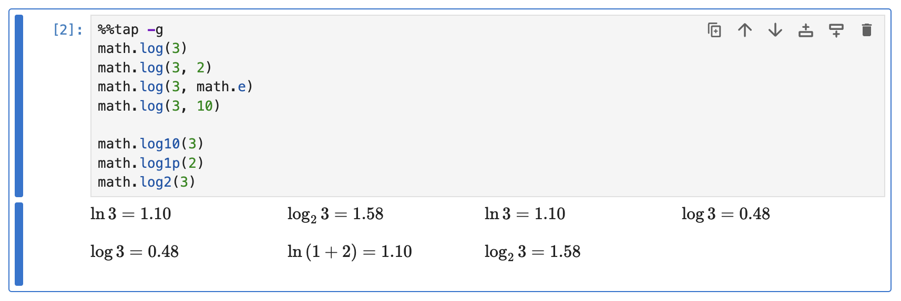
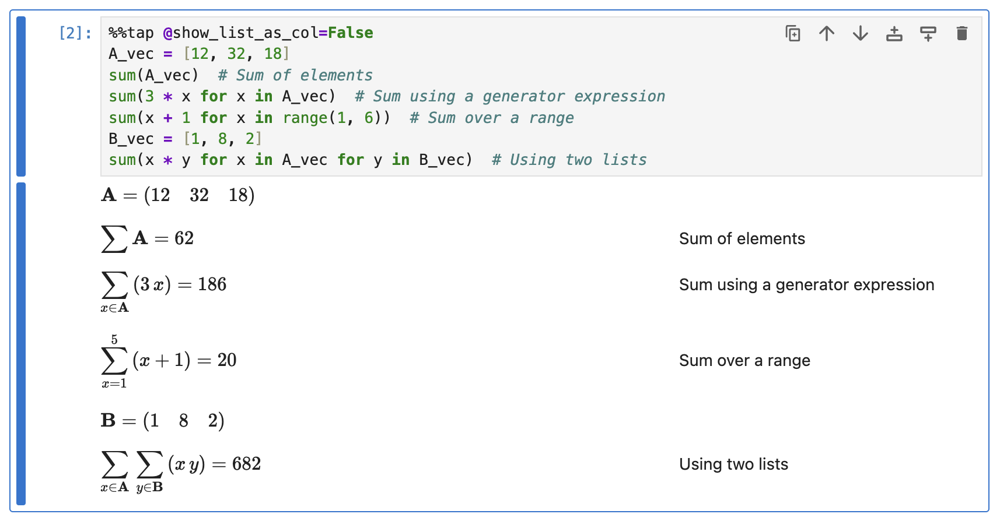
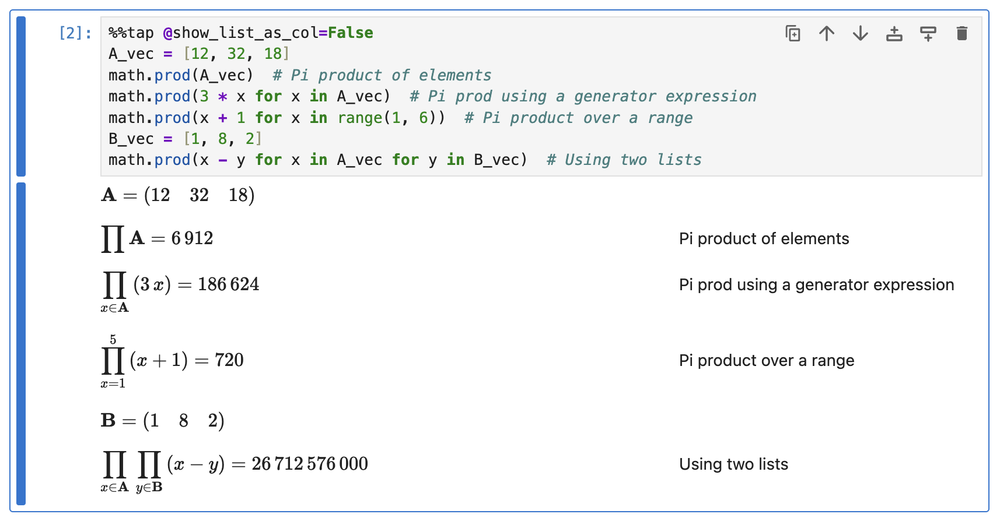
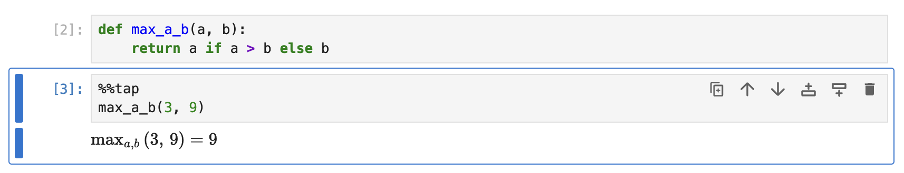

# Class and Function Calls

This guide demonstrates how Rubberize renders various class and function calls.

## Class Calls

Class calls to instantiate built-in types are rendered as the resulting instance, rather than as a function call:

```python
%%tap -g
from decimal import Decimal
from fractions import Fraction

int(42.3042)
float(69)
Decimal('0.00004291')
Fraction(0.3125)

complex(3, 4)
list((3, 5, 6))
tuple([3, 5, 6])
set([3, 5, 6])

dict([("a", 1), ("b", 2)])
range(25)
```

<picture>
    <source media="(prefers-color-scheme: dark)" srcset="../assets/rendering/calls/class_calls_dark.png">
    <source media="(prefers-color-scheme: light)" srcset="../assets/rendering/calls/class_calls.png">
    
</picture>

## Built-in Functions

Most mathematical functions built into Python are rendered in math notation:

```python
%%tap -g
abs(-40)
math.fabs(-42.0)
math.ceil(8008.135)
math.floor(8008.135)

math.comb(5, 3)
math.perm(5, 3)
math.exp(5)
math.exp(5/2)

math.gamma(11)
math.factorial(10)
math.sqrt(3**2 + 4**2)
math.cbrt(3**2 + 4**2)
```

<picture>
    <source media="(prefers-color-scheme: dark)" srcset="../assets/rendering/calls/builtin_funcs_dark.png">
    <source media="(prefers-color-scheme: light)" srcset="../assets/rendering/calls/builtin_funcs.png">
    
</picture>

### Trigonometric Functions

Trigonometric functions are considered unary functions. If its argument is a single value and not an expression, it will not be wrapped in parentheses.

```python
%%tap
math.sin(1.309)
math.sin(75 * ureg.deg)
math.sin(math.pi / 4 + math.pi / 6)
```

<picture>
    <source media="(prefers-color-scheme: dark)" srcset="../assets/rendering/calls/sin_dark.png">
    <source media="(prefers-color-scheme: light)" srcset="../assets/rendering/calls/sin.png">
    
</picture>

### Logarithm Functions

Rubberize follows the convention of using $\log x$ for the common logarithm (base 10) and $\ln x$ for the natural logarithm.

```python
%%tap -g
math.log(3)
math.log(3, 2)
math.log(3, math.e)
math.log(3, 10)

math.log10(3)
math.log1p(2)
math.log2(3)
```

<picture>
    <source media="(prefers-color-scheme: dark)" srcset="../assets/rendering/calls/log_dark.png">
    <source media="(prefers-color-scheme: light)" srcset="../assets/rendering/calls/log.png">
    
</picture>

### Summation and Pi Product

The following summations can be rendered properly by Rubberize:

- Summation of elements of an iterable (e.g., a list)
- Summation using a generator expression for an iterable
- Summation using a generator expression over a range

```python
%%tap @show_list_as_col=False
A_vec = [12, 32, 18]
sum(A_vec)  # Sum of elements
sum(3 * x for x in A_vec)  # Sum using a generator expression
sum(x + 1 for x in range(1, 6))  # Sum over a range
B_vec = [1, 8, 2]
sum(x * y for x in A_vec for y in B_vec)  # Using two lists
```

<picture>
    <source media="(prefers-color-scheme: dark)" srcset="../assets/rendering/calls/sum_dark.png">
    <source media="(prefers-color-scheme: light)" srcset="../assets/rendering/calls/sum.png">
    
</picture>

The same rendering rules also apply to pi products:

```python
%%tap @show_list_as_col=False
A_vec = [12, 32, 18]
math.prod(A_vec)  # Pi product of elements
math.prod(3 * x for x in A_vec)  # Pi prod using a generator expression
math.prod(x + 1 for x in range(1, 6))  # Pi product over a range
B_vec = [1, 8, 2]
math.prod(x - y for x in A_vec for y in B_vec)  # Using two lists
```

<picture>
    <source media="(prefers-color-scheme: dark)" srcset="../assets/rendering/calls/prod_dark.png">
    <source media="(prefers-color-scheme: light)" srcset="../assets/rendering/calls/prod.png">
    
</picture>

## Unknown Functions

If a function is unknown to Rubberize, its operator name will be converted the same way as a variable, while the rest—parentheses and arguments—will be rendered as written.

```python
def max_a_b(a, b):
    return a if a > b else b
```

```python
%%tap
max_a_b(3, 9)
```

<picture>
    <source media="(prefers-color-scheme: dark)" srcset="../assets/rendering/calls/unknown_dark.png">
    <source media="(prefers-color-scheme: light)" srcset="../assets/rendering/calls/unknown.png">
    
</picture>

If you want, you can use `register_call_converter()` to define how Rubberize should render a specific function call. For a step-by-step guide on creating custom converters, refer to the [Custom Calls](custom_types.md#creating-a-call-converter) guide.

## Suppress Conversion of Calls

If you want to stop Rubberize from rendering class and function calls based on special conversion rules and make them appear similar to unknown functions, set the `@convert_special_funcs` config option (a `bool`, default is `True`) to `False`.

This might be useful for cases where the name of a custom function you are using is the same as one of the supported function names.

## What's Next?

* Go to [Custom Calls](custom_types.md#creating-a-call-converter) to learn how to create and register a converter for your custom object type.
* Go back to [Expression and Statement Rendering](index.md) index to look at how other elements are rendered.