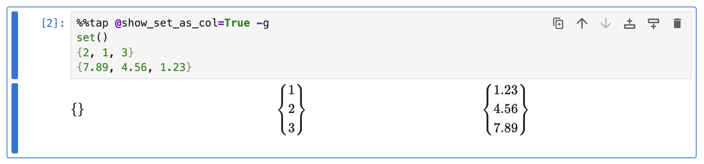

# Collections

This guide demonstrates how Rubberize renders various types of collections, including lists, tuples, sets, and dictionaries, with customizable formatting options for separators, alignment, and key-value pair rendering.

## Lists

Lists are rendered as an array.

```python
%%tap -g
[]
[1, 2, 3]
[1.23, 4.56, 7.89]
```

<picture>
    <source media="(prefers-color-scheme: dark)" srcset="../assets/rendering/collections/lists_dark.png">
    <source media="(prefers-color-scheme: light)" srcset="../assets/rendering/collections/lists.png">
    
</picture>

### Render as Row Array

By default, lists are displayed as a column array.

To render them as row arrays, you can set the config option `@show_list_as_col` (a `bool`, default is `True`) to `False`.

```python
%%tap @show_list_as_col=False
[]
[1, 2, 3]
[1.23, 4.56, 7.89]
```

<picture>
    <source media="(prefers-color-scheme: dark)" srcset="../assets/rendering/collections/lists_row_dark.png">
    <source media="(prefers-color-scheme: light)" srcset="../assets/rendering/collections/lists_row.png">
    
</picture>


## Tuples

Tuples are rendered as a comma-separated listing of elements.

```python
%%tap
()
(1, 2, 3)
(1.23, 4.56, 7.89)
```

<picture>
    <source media="(prefers-color-scheme: dark)" srcset="../assets/rendering/collections/tuples_dark.png">
    <source media="(prefers-color-scheme: light)" srcset="../assets/rendering/collections/tuples.png">
    
</picture>

### Align vertically

By default, tuple elements are comma-separated and aligned horizontally.

You can align tuple items vertically by setting the `@show_tuple_as_col` config option (a `bool`, default is `False`) to `True`.

```python
%%tap @show_tuple_as_col=True -g
()
(1, 2, 3)
(1.23, 4.56, 7.89)
```

<picture>
    <source media="(prefers-color-scheme: dark)" srcset="../assets/rendering/collections/tuples_col_dark.png">
    <source media="(prefers-color-scheme: light)" srcset="../assets/rendering/collections/tuples_col.png">
    
</picture>

## Sets

Sets are rendered as such.

```python
%%tap
set()
{2, 1, 3}
{7.89, 4.56, 1.23}
```

<picture>
    <source media="(prefers-color-scheme: dark)" srcset="../assets/rendering/collections/sets_dark.png">
    <source media="(prefers-color-scheme: light)" srcset="../assets/rendering/collections/sets.png">
    
</picture>

### Align vertically

By default, sets items are comma-separated and aligned horizontally.

You can align set items vertically by setting the `@show_set_as_col` config option (a `bool`, default is `False`) to `True`.

```python
%%tap @show_set_as_col=True -g
set()
{2, 1, 3}
{7.89, 4.56, 1.23}
```

<picture>
    <source media="(prefers-color-scheme: dark)" srcset="../assets/rendering/collections/sets_col_dark.png">
    <source media="(prefers-color-scheme: light)" srcset="../assets/rendering/collections/sets_col.png">
    
</picture>

## Dictionaries

Dictionaries are shown as key-value pairs enclosed within a set braces.

```python
%%tap
{}
{"a": 1, "b": 2, "c": 3}
{1: 7.89, 2: 4.56, 3: 1.23}
```

<picture>
    <source media="(prefers-color-scheme: dark)" srcset="../assets/rendering/collections/dicts_dark.png">
    <source media="(prefers-color-scheme: light)" srcset="../assets/rendering/collections/dicts.png">
    
</picture>

### Align horizontally

By default, dictionary key-value pairs are aligned vertically.

You can arrange dictionary key-value pairs horizontally by setting the `@show_dict_as_col` config option (a `bool`, default is `True`) to `False`.

```python
%%tap @show_dict_as_col=False
{}
{"a": 1, "b": 2, "c": 3}
{1: 7.89, 2: 4.56, 3: 1.23}
```

<picture>
    <source media="(prefers-color-scheme: dark)" srcset="../assets/rendering/collections/dicts_row_dark.png">
    <source media="(prefers-color-scheme: light)" srcset="../assets/rendering/collections/dicts_row.png">
    
</picture>

## Nesting Collections

Rubberize supports rendering nested collections, allowing you to visualize complex data structures with ease. Nested collections can include combinations of lists, tuples, sets, and dictionaries.

```python
%%tap
[1, (2, 3), {4, 5, 6}, {"a": 7, "b": 8}]
({"x": [9, 10], "y": {11, 12}}, [13, {"z": 14}])
```

<picture>
    <source media="(prefers-color-scheme: dark)" srcset="../assets/rendering/collections/nested_dark.png">
    <source media="(prefers-color-scheme: light)" srcset="../assets/rendering/collections/nested.png">
    
</picture>

### Customizing Nested Rendering

You can customize the rendering of nested collections by combining the config options for individual collection types. For example, to display lists as rows and tuples as columns within a nested structure:

```python
%%tap @show_list_as_col=False @show_tuple_as_col=True
[1, (2, 3), {4, 5, 6}, {"a": 7, "b": 8}]
({"x": [9, 10], "y": {11, 12}}, [13, {"z": 14}])
```

<picture>
    <source media="(prefers-color-scheme: dark)" srcset="../assets/rendering/collections/nested_custom_dark.png">
    <source media="(prefers-color-scheme: light)" srcset="../assets/rendering/collections/nested_custom.png">
    
</picture>

## What's Next?

Go back to [Expression and Statement Rendering](index.md) index to look at how other elements are rendered.