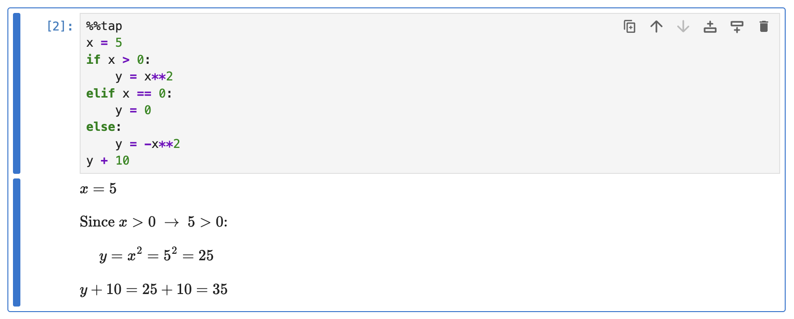
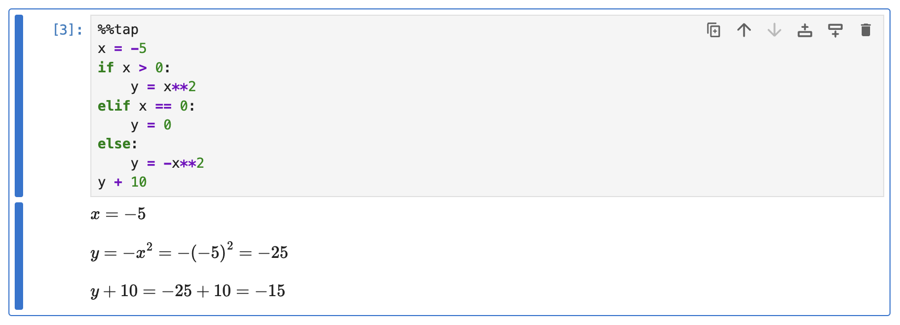
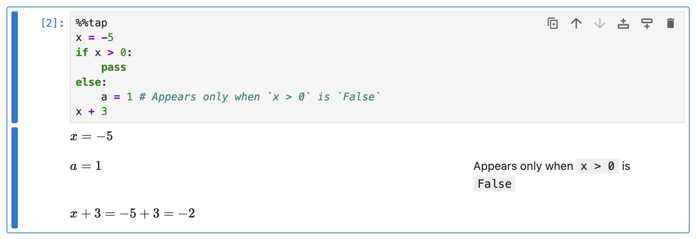
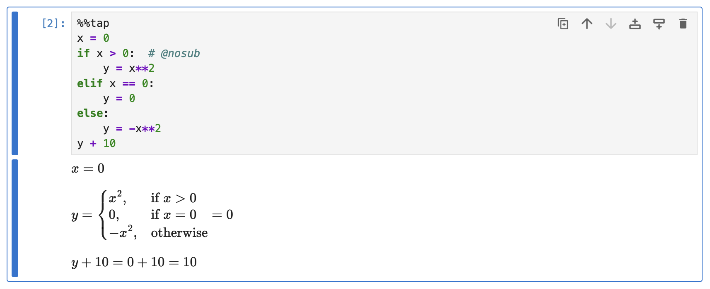
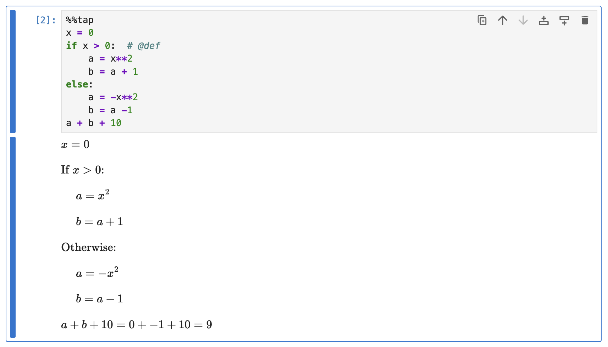

# Conditional Statements

This guide demonstrates how Rubberize renders conditional statements (an `if`-`elif`-`else` ladder), including ways how to customize it.

By default, Rubberize renders only the lines within the `True` path of the conditional ladder, with the condition itself being displayed as an introductory expression. The lines within the `True` path are indented to visually indicate that they belong to this block. The other branches are not rendered:

```python
%%tap
x = 5
if x > 0:
    y = x**2
elif x == 0:
    y = 0
else:
    y = -x**2
y + 10
```

<picture>
    <source media="(prefers-color-scheme: dark)" srcset="../assets/rendering/conditionals/conditional_dark.png">
    <source media="(prefers-color-scheme: light)" srcset="../assets/rendering/conditionals/conditional.png">
    
</picture>

If no conditions are `True`, nothing within the conditional block will be rendered.

However, if an `else` statement is provided, lines within this block will be rendered without any indentation and introductory expression. In the example, if we set `x = -5`:

<picture>
    <source media="(prefers-color-scheme: dark)" srcset="../assets/rendering/conditionals/conditional_else_dark.png">
    <source media="(prefers-color-scheme: light)" srcset="../assets/rendering/conditionals/conditional_else.png">
    
</picture>

> [!WARNING]
> **Gotcha:** Since Rubberize generates the rendering based on the actual execution of the Python code, it's important to note that if a test within the conditional ladder alters the value being tested, Rubberize will use the changed value in generating the rendered output. **This means that if the value is modified within the conditional block, the render may not appear as expected.**
>
> This code will not render properly:
> ```python
> %%tap
> x = 5
> if x > 0:
>     x = -1
> ```
> because for Rubberize, the value of `x` is `-1`, not `5`.
>
> To avoid confusion and ensure accurate rendering, **do not modify the value being tested within the conditional ladder.** Keep the value consistent across the conditions to avoid unexpected behavior in the rendered output.

## Skipping Code with `pass` in the `True` Path

When Rubberize encounters a conditional ladder where the `True` path contains only a `pass` statement, nothing will be rendered. This is useful when you want to skip a chunk of calculations within an `else` block.

```python
%%tap
x = -5
if x > 0:
    pass
else:
    a = 1  # Appears only when `x > 0` is `False`
x + 3
```

<picture>
    <source media="(prefers-color-scheme: dark)" srcset="../assets/rendering/conditionals/conditional_pass_dark.png">
    <source media="(prefers-color-scheme: light)" srcset="../assets/rendering/conditionals/conditional_pass.png">
    
</picture>

## Showing All Conditions

To show all the conditions in the ladder, turn off the substitution display mode either by setting `@show_substitution=False`, or using any of the keywords that turn it (but not definitions) off: `@nosub` or `@def`.

### As Cases Assignment

If all of the branches in the conditional ladder only contain a single assignment statement to the same variable, it will be rendered as a cases assignment:

```python
%%tap
x = 0
if x > 0:  # @nosub
    y = x**2
elif x == 0:
    y = 0
else:
    y = -x**2
y + 10
```

<picture>
    <source media="(prefers-color-scheme: dark)" srcset="../assets/rendering/conditionals/cases_dark.png">
    <source media="(prefers-color-scheme: light)" srcset="../assets/rendering/conditionals/cases.png">
    
</picture>

> [!NOTE]
> Config option and keyword modifiers written as a line comment on the first conditional branch applies to the whole ladder.

### As Blocks

If any of the branches has more than one statement or with different assignment targets, all cases will be shown. For this, you should use `@def` (or also turn off definition using `@show_definition=False`) so that result values, which may be different for each conditional branch, is not shown.

```python
%%tap
x = 0
if x > 0:  # @def
    a = x**2
    b = a + 1
else:
    a = -x**2
    b = a -1
a + b + 10
```

<picture>
    <source media="(prefers-color-scheme: dark)" srcset="../assets/rendering/conditionals/all_conditions_dark.png">
    <source media="(prefers-color-scheme: light)" srcset="../assets/rendering/conditionals/all_conditions.png">
    
</picture>

## What's Next?

Go back to [Expression and Statement Rendering](index.md) index to look at how other elements are rendered.