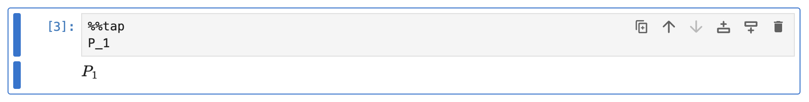
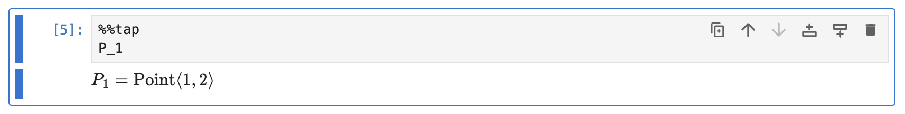
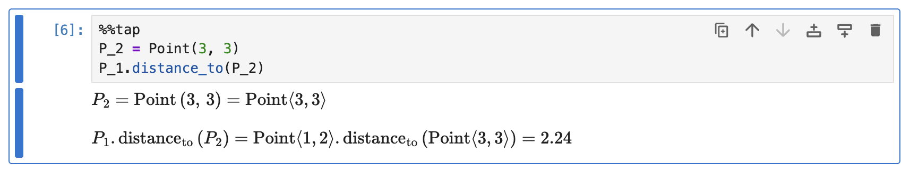
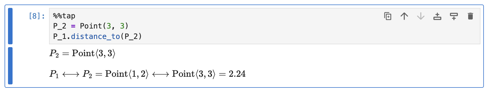
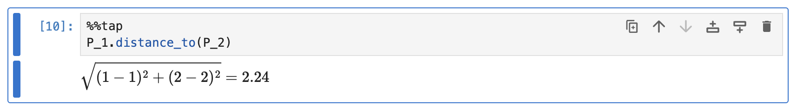

# Custom Types and Calls

> [!TIP]
> You can download the [notebook version](../assets/rendering/custom_types/custom_types.ipynb) of this guide to follow along.

If Rubberize encounters an object that it doesn't have a conversion for, it won't try to render a mathematical representation. Instead, it will simply render the variable name.

For example, if you have a `Point` class defined as:

```python
class Point:
    def __init__(self, x, y):
        self.x = x
        self.y = y

    def distance_to(self, other):
        return ((self.x - other.x) ** 2 + (self.y - other.y) ** 2) ** 0.5

P_1 = Point(1, 2)
```

By default, Rubberize won’t know how to convert `Point`, so it will just output the variable name:

```python
%%tap
P_1
```

<picture>
    <source media="(prefers-color-scheme: dark)" srcset="../assets/rendering/custom_types/custom_type_before_dark.png">
    <source media="(prefers-color-scheme: light)" srcset="../assets/rendering/custom_types/custom_type_before.png">
    
</picture>

This ensures that unknown objects doesn't cause unexpected output.

## Creating an Object Converter

To handle such cases, you can use `register_objects_converter()` to define and add an appropriate converter function for the object type. This allows Rubberize to recognize and properly transform the object into a defined math representation.

The register function takes **two arguments**:

1. `cls`: A **class type**. This specifies which objects the converter should apply to.
2. `func`: A **converter function**. This should function must be defined to take at least an instance of `cls` (which is the object to convert) and return an `ExprLatex` instance, which contains the LaTeX representation of the object, or `None` if the object should be considered unconvertible.

Internally, this registration maps `cls` to `func`, so that when an instance of `cls` is encountered, Rubberize can look up the correct converter and apply it.

Continuing the example above, we define `convert_point()` and register it as an object converter:

```python
from rubberize.latexer.ranks import COLLECTIONS_RANK

# Define the converter function
def convert_point(obj):
    return rubberize.ExprLatex(
        rf"\mathrm{{Point}} \langle {obj.x}, {obj.y} \rangle",  # The LaTeX to generate
        rank=COLLECTIONS_RANK  # Precedence rank
    )

# Register the converter function
rubberize.register_object_converter(Point, convert_point)
```

Now, when we try to render the object, it will be rendered correctly:

```python
%%tap
P_1
```

<picture>
    <source media="(prefers-color-scheme: dark)" srcset="../assets/rendering/custom_types/custom_type_dark.png">
    <source media="(prefers-color-scheme: light)" srcset="../assets/rendering/custom_types/custom_type.png">
    
</picture>

### Assigning a Rank

When creating an `ExprLatex` instance, you can specify a **rank** to indicate the precedence of an expression. **A larger rank means a higher precedence**. This rank determines whether Rubberize will apply parentheses around the expression when included as an operand in a larger mathematical expression.

A **rank** is actually an integer value, but `rubberize.latexer.ranks` provide self-explanatory helper constants for the assignment:

| Helper Constant    | Rank Value | Helper Constant   | Rank Value |
| ------------------ | ---------- | ----------------- | ---------- |
| `VALUE_RANK`       | `9_001`    | `DIV_RANK`        | `130`      |
| `COLLECTIONS_RANK` | `180`      | `BELOW_MULT_RANK` | `129`      |
| `POW_RANK`         | `150`      | `ADD_RANK`        | `120`      |
| `BELOW_POW_RANK`   | `149`      | `SUB_RANK`        | `120`      |
| `MULT_RANK`        | `130`      | `BELOW_ADD_RANK`  | `119`      |


If no explicit rank is provided, it is assigned a rank of `VALUE_RANK`, which represents standalone values that do not require parentheses unless explicitly needed.

## Creating a Call Converter

Continuing the example, if we try to render an instantiation of another `Point` and call the `distance_to()` method:

```python
%%tap
P_2 = Point(3, 3)
P_1.distance_to(P_2)
```

<picture>
    <source media="(prefers-color-scheme: dark)" srcset="../assets/rendering/custom_types/custom_call_before_dark.png">
    <source media="(prefers-color-scheme: light)" srcset="../assets/rendering/custom_types/custom_call_before.png">
    
</picture>

Calls are rendered as general function operators.

If you want, you can also define and add appropriate converters for instatiations, and function and method calls so that they are also rendered beautifully. For that, you can use `register_call_converter()`.

The register function takes **two arguments**:

1. `name`: A **string**. This specifies the class, function, or method name the converter should apply to.
2. `func`: A **converter function**, which can be one of the common converters from `rubberize.latexer.calls.common`, or a fully customized one.

### Using a Common Converter

Rubberize has several ready-made call converter functions, all of which are available in `rubberize.latexer.calls.common`:

| Converter                | Args in addition to<br>`visitor` and `call`        | Purpose                                                                                                                                                  |
| ------------------------ | -------------------------------------------------- | -------------------------------------------------------------------------------------------------------------------------------------------------------- |
| `get_result_and_convert` | None                                               | Gets the resulting object of a call node's call, and then renders the resulting object.                                                                  |
| `wrap`                   | `prefix, suffix[, sep=",\, ", *, rank=VALUE_RANK]` | Adds prefix (`prefix`), suffix (`suffix`), and optional separator (`sep`) to arguments. Can also be assigned a precedence rank (`rank`).                 |
| `wrap_method`            | `prefix, suffix[, sep=",\, ", *, rank=VALUE_RANK]` | Same as `wrap`, but treats the attribute value as the first argument.                                                                                    |
| `rename`                 | `name[, *, rank=VALUE_RANK]`                       | Changes the operator name to a specified one (`name`). Can also be assigned a precedence rank (`rank`).                                                  |
| `unary`                  | `prefix[, suffix=""]`                              | Create an unary function using a prefix (`prefix`) and optional suffix (`suffix`) to render something like $\cos x$ instead of $\operatorname {cos}(x)$. |
| `first_arg`              | None                                               | Returns only the first argument of the call, effectively hiding the call on the first arg.                                                               |
| `hide_method`            | `cls`                                              | Renders the parent object of a method call if the parent matches `cls` and hides the method call and its arguments.                                      |

If the common conversion function takes more than two arguments, you can use a `lambda` to pass `visitor` and `call` to the converter and supply your own arguments to the rest.

Continuing the example, we register converters for `Point()` and `distance_to()`:

```python
# Import Rubberize helper functions as needed
from rubberize.latexer.calls.common import get_result_and_convert, wrap_method
from rubberize.latexer.ranks import BELOW_ADD_RANK

# Register the call converter functions
rubberize.register_call_converter("Point", get_result_and_convert)
rubberize.register_call_converter(
    "distance_to",
    lambda v, c: wrap_method(v, c, "", "", r" \longleftrightarrow ", rank=BELOW_ADD_RANK),
)
```

Now, when we try to render the calls, it will be rendered correctly:

```python
%%tap
P_2 = Point(3, 3)
P_1.distance_to(P_2) + 7
```

<picture>
    <source media="(prefers-color-scheme: dark)" srcset="../assets/rendering/custom_types/custom_call_dark.png">
    <source media="(prefers-color-scheme: light)" srcset="../assets/rendering/custom_types/custom_call.png">
    
</picture>

### Creating Your Own Converter Function

If you want more control, you can supply your own conversion function. However this requires more familiarity with Rubberize's `ExprVisitor` class and `node_helper` functions, as well as Python's `ast` library.

The custom conversion function `func` must be defined to take at least two arguments:

1. An instance of the `ExprVisitor` class that contains `ast` node visitor methods and the namespace (a dictionary mapping of names and objects for the environment) that can be used within the function for object lookups if needed.
2. An `ast.Call` node, which is the AST representation of the call to be converted.

`func` must return an `ExprLatex` instance, which contains the LaTeX representation of the call, or `None` if the call should be considered unconvertible.

Continuing the example, we define our own converter for `distance_to()`:

```python
from rubberize.latexer.node_helpers import get_object
from rubberize.latexer.objects import convert_object
from rubberize.latexer.ranks import BELOW_POW_RANK

# Define the call converter function for distance_to_call()
def convert_distance_to_call(visitor, call):
    obj0 = get_object(call.func.value, visitor.namespace)
    obj1 = get_object(call.func.value, visitor.namespace)
    
    x0 = convert_object(obj0.x).latex
    y0 = convert_object(obj0.y).latex
    x1 = convert_object(obj1.x).latex
    y1 = convert_object(obj1.y).latex
    
    return rubberize.ExprLatex(
        rf"\sqrt{{({x0} - {x1})^{{2}} + ({y0} - {y1})^{{2}}}}", BELOW_POW_RANK
    )

# Register the converter
rubberize.register_call_converter("distance_to", convert_distance_to_call)
```

Now, the method call will be rendered like so:

```python
%%tap
P_1.distance_to(P_2)
```
<picture>
    <source media="(prefers-color-scheme: dark)" srcset="../assets/rendering/custom_types/custom_call_2_dark.png">
    <source media="(prefers-color-scheme: light)" srcset="../assets/rendering/custom_types/custom_call_2.png">
    
</picture>

## What's Next?

Go back to [Expression and Statement Rendering](index.md) index to look at how other elements are rendered.
