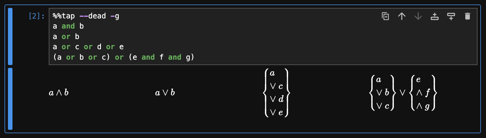
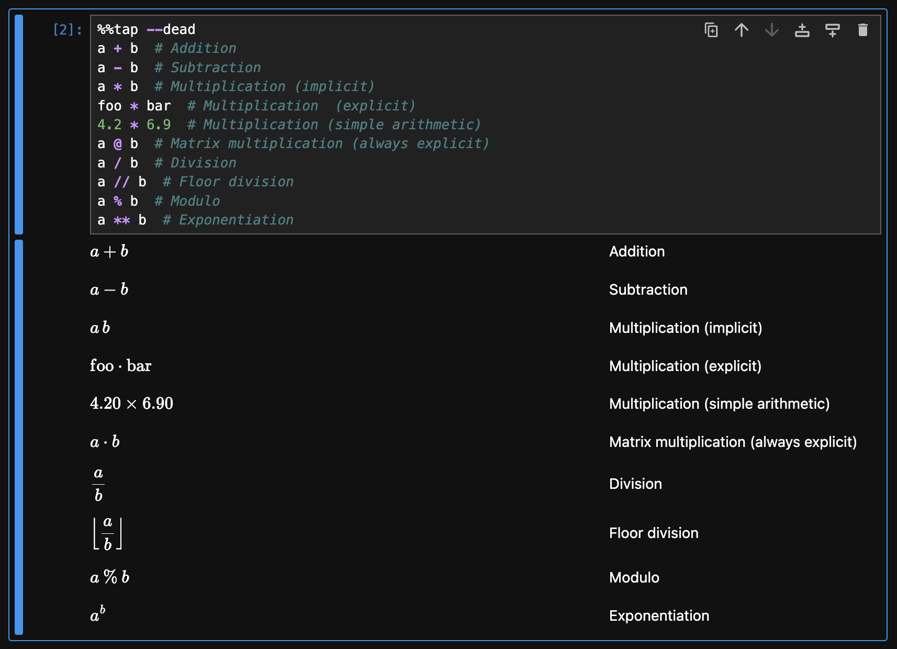
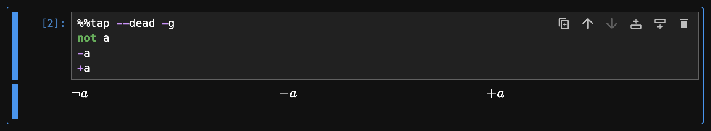
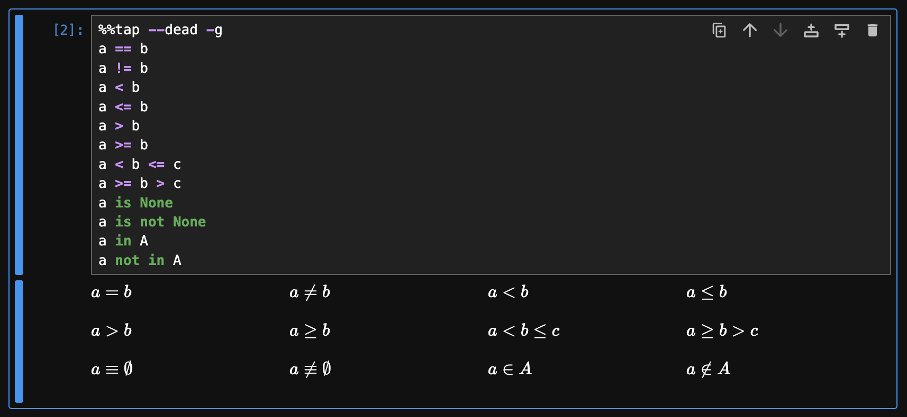
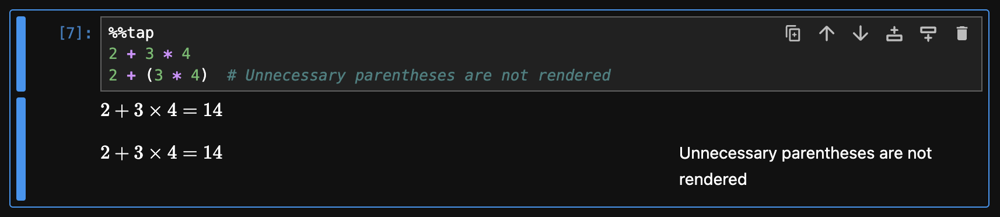
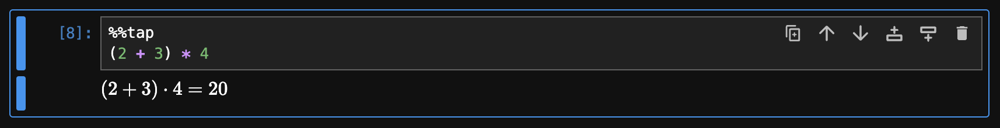
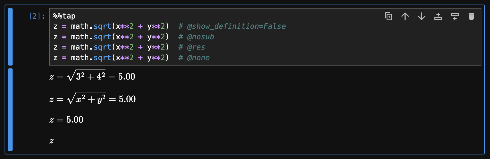
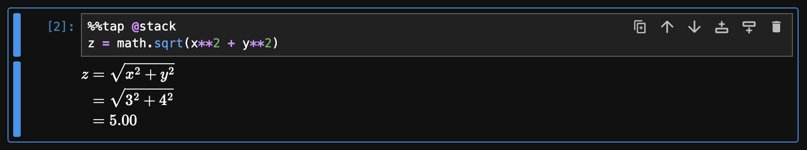
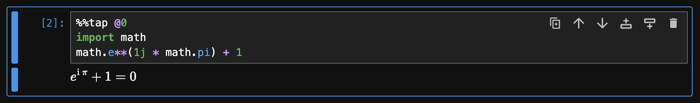

# Operators and Expressions

This guide explains how Rubberize renders expressions and the available options for customizing their display.

Previous sections have covered how Rubberize handles variables, numbers, collections, and other values. These elements are combined using operators to form expressions, which are processed according to their structure and precedence rules.

## Boolean Operations

The boolean operators `and` and `or` are rendered as logical symbols. To avoid having very long lines, consecutive operations are grouped within curly braces:

```python
%%tap --dead -g
a and b
a or b
a or c or d or e
(a or b or c) or (e and f and g)
```

<picture>
    <source media="(prefers-color-scheme: dark)" srcset="../assets/rendering/expressions/boolop_dark.png">
    <source media="(prefers-color-scheme: light)" srcset="../assets/rendering/expressions/boolop.png">
    
</picture>

## Binary Operations

Binary operations are rendered by Rubberize in mathematical notation:

```python
%%tap --dead
a + b  # Addition
a - b  # Subtraction
a * b  # Multiplication (implicit)
foo * bar  # Multiplication  (explicit)
4.2 * 6.9  # Multiplication (simple arithmetic)
a @ b  # Matrix multiplication (always explicit)
a / b  # Division
a // b  # Floor division
a % b  # Modulo
a ** b  # Exponentiation
```

<picture>
    <source media="(prefers-color-scheme: dark)" srcset="../assets/rendering/expressions/binop_dark.png">
    <source media="(prefers-color-scheme: light)" srcset="../assets/rendering/expressions/binop.png">
    
</picture>

### Contextual Multiplication Symbol

By default, Rubberize infers which symbol to use for multiplication based on how the operands are rendered. In mathematical notation, different symbols such as the multiplication symbol ($\times$), a dot ($\cdot$), or implicit multiplication (a thin space) are used depending on readability and convention.

The following table illustrates how Rubberize determines the appropriate multiplication symbol based on the types of operands involved. The row (**L**) represents the left operand, and the column (**R**) represents the right operand. The intersection of a row and a column specifies the multiplication symbol used when those operand types are multiplied.

The operand types are:

- **N**: Numeric values (e.g., $3$, $-2.50$)
- **L**: Letter variables (a single-character *base name*), including Greek letters, which are rendered in italics (e.g., $x$, $a_{\mathrm{foo}}$, $\epsilon$, $\Delta T$)
- **W**: Word variables (with multiple characters for *base name*), which are rendered in Roman font (e.g., $\mathrm{foo}$, $\mathrm{var}_{a}$, $\Delta \mathrm{Temp}$)
- **C**: Function (or class, or method) call. (e.g., $\cos \alpha$, $\mathrm{fcn}(a, b)$ )
- **B**: Bracketed expressions
- **?**: Other type not covered (should be explicit)

Signed versions of each type are denoted by the **-** prefix.

|  L \ R |  N  | -N  |  L  | -L  |  W  | -W  |  C  | -C  |  B  | -B  |  ?  | -?  |
| -----: | :-: | :-: | :-: | :-: | :-: | :-: | :-: | :-: | :-: | :-: | :-: | :-: |
|  **N** |  ×  |  ×  |     |  ⋅  |     |  ⋅  |     |  ⋅  |     |  ⋅  |  ⋅  |  ⋅  |
| **-N** |  ×  |  ×  |     |  ⋅  |     |  ⋅  |     |  ⋅  |     |  ⋅  |  ⋅  |  ⋅  |
|  **L** |  ⋅  |  ⋅  |     |  ⋅  |  ⋅  |  ⋅  |  ⋅  |  ⋅  |  ⋅  |  ⋅  |  ⋅  |  ⋅  |
| **-L** |  ⋅  |  ⋅  |     |  ⋅  |  ⋅  |  ⋅  |  ⋅  |  ⋅  |  ⋅  |  ⋅  |  ⋅  |  ⋅  |
|  **W** |  ⋅  |  ⋅  |  ⋅  |  ⋅  |  ⋅  |  ⋅  |  ⋅  |  ⋅  |  ⋅  |  ⋅  |  ⋅  |  ⋅  |
| **-W** |  ⋅  |  ⋅  |  ⋅  |  ⋅  |  ⋅  |  ⋅  |  ⋅  |  ⋅  |  ⋅  |  ⋅  |  ⋅  |  ⋅  |
|  **C** |  ⋅  |  ⋅  |  ⋅  |  ⋅  |  ⋅  |  ⋅  |  ⋅  |  ⋅  |  ⋅  |  ⋅  |  ⋅  |  ⋅  |
| **-C** |  ⋅  |  ⋅  |  ⋅  |  ⋅  |  ⋅  |  ⋅  |  ⋅  |  ⋅  |  ⋅  |  ⋅  |  ⋅  |  ⋅  |
|  **B** |  ⋅  |  ⋅  |     |  ⋅  |     |  ⋅  |     |  ⋅  |     |  ⋅  |  ⋅  |  ⋅  |
| **-B** |  ⋅  |  ⋅  |     |  ⋅  |     |  ⋅  |     |  ⋅  |     |  ⋅  |  ⋅  |  ⋅  |
|  **?** |  ⋅  |  ⋅  |  ⋅  |  ⋅  |  ⋅  |  ⋅  |  ⋅  |  ⋅  |  ⋅  |  ⋅  |  ⋅  |  ⋅  |
| **-?** |  ⋅  |  ⋅  |  ⋅  |  ⋅  |  ⋅  |  ⋅  |  ⋅  |  ⋅  |  ⋅  |  ⋅  |  ⋅  |  ⋅  |

You can turn off this feature and have Rubberize render all multiplication with dot ($\cdot$) by setting the `@use_contextual_mult` config option (a `bool`, default is `True`) to `False`.

## Unary Operations

Unary operations are rendered by Rubberize:

```python
%%tap --dead -g
not a
-a
+a
```

<picture>
    <source media="(prefers-color-scheme: dark)" srcset="../assets/rendering/expressions/unaryop_dark.png">
    <source media="(prefers-color-scheme: light)" srcset="../assets/rendering/expressions/unaryop.png">
    
</picture>

## Comparisons

Comparisons are rendered by Rubberize:

```python
%%tap --dead -g
a == b
a != b
a < b
a <= b
a > b
a >= b
a < b <= c
a >= b > c
a is None
a is not None
a in A
a not in A
```

<picture>
    <source media="(prefers-color-scheme: dark)" srcset="../assets/rendering/expressions/comparisons_dark.png">
    <source media="(prefers-color-scheme: light)" srcset="../assets/rendering/expressions/comparisons.png">
    
</picture>

## Operator Precedence

Rubberize follows Python's standard operator precedence rules[^2] when deciding how to properly render an expression. when an operation already naturally follows the operator precedence, Rubberize renders it without any extra parentheses:

```python
%%tap
2 + 3 * 4
2 + (3 * 4)  # Unnecessary parentheses are not rendered
```

<picture>
    <source media="(prefers-color-scheme: dark)" srcset="../assets/rendering/expressions/precedence_1_dark.png">
    <source media="(prefers-color-scheme: light)" srcset="../assets/rendering/expressions/precedence_1.png">
    
</picture>

Because multiplication has higher precedence than addition, no parentheses are needed. However, when an operation requires explicit grouping, Rubberize includes parentheses:

```python
%%tap
(2 + 3) * 4
```

<picture>
    <source media="(prefers-color-scheme: dark)" srcset="../assets/rendering/expressions/precedence_2_dark.png">
    <source media="(prefers-color-scheme: light)" srcset="../assets/rendering/expressions/precedence_2.png">
    
</picture>

## Expression Display Modes

Rubberize renders a math expression in three ways:

| Display Mode     | Description                                                                      | Example                              |
| ---------------- | -------------------------------------------------------------------------------- | ------------------------------------ |
| **Definition**   | The base form of the expression, before substituting specific values.            | $\displaystyle \sqrt{x^{2} + y^{2}}$ |
| **Substitution** | The expression after substituting numerical values for variables.                | $\displaystyle \sqrt{3^{2} + 4^{2}}$ |
| **Result**       | The final calculated value of the expression after all operations are performed. | $\displaystyle 5.00$                 |

By default, Rubberize generates all three display modes, arranging them as equalities on a single line:

```python
%%tap
import math

# **The Pythagorean theorem**
a = 3  # Length of first leg
b = 4  # Length of second leg
c = math.sqrt(a**2 + b**2)  # Length of the hypotenuse
```

<picture>
    <source media="(prefers-color-scheme: dark)" srcset="../assets/getting_started/rendering_python_calculations_dark.png">
    <source media="(prefers-color-scheme: light)" srcset="../assets/getting_started/rendering_python_calculations.png">
    
</picture>

### Managing the Display Modes

You can configure which display modes are included during rendering using either the following `config` option or *keyword*:

| Display Mode     | `config` Option                                       | Keyword to show/hide<br>only the display mode |
| ---------------- | ----------------------------------------------------- | --------------------------------------------- |
| **Definition**   | `@show_definition`<br>(a `bool`, default is `True`)   | `@def`/`@nodef`                               |
| **Substitution** | `@show_substitution`<br>(a `bool`, default is `True`) | `@sub`/`@nosub`                               |
| **Result**       | `@show_result`<br>(a `bool`, default is `True`)       | `@res`/`@nosub`                               |

Additionally, the keyword `@none` hides all display modes, while `@all` shows all display modes.

```python
%%tap
z = math.sqrt(x**2 + y**2)  # @show_definition=False
z = math.sqrt(x**2 + y**2)  # @nosub
z = math.sqrt(x**2 + y**2)  # @res
z = math.sqrt(x**2 + y**2)  # @none
```

<picture>
    <source media="(prefers-color-scheme: dark)" srcset="../assets/rendering/expressions/display_modes_dark.png">
    <source media="(prefers-color-scheme: light)" srcset="../assets/rendering/expressions/display_modes.png">
    
</picture>

### Stacking Display Modes

Instead of being on a single line, you can stack the display modes vertically by setting the `@multiline` config option (a `bool`, default is `True`) to `False`, or simply using the `@stack` keyword. This feature is useful for ensuring that very long equations don't get cut off from the page.

```python
%%tap @stack
z = math.sqrt(x**2 + y**2)
```

<picture>
    <source media="(prefers-color-scheme: dark)" srcset="../assets/rendering/expressions/stack_dark.png">
    <source media="(prefers-color-scheme: light)" srcset="../assets/rendering/expressions/stack.png">
    
</picture>

### Math Constants in Substitution Display Mode

Rubberize preserves the names for mathematical constants $e$, $\pi$, and $\varphi$ when rendering the substitution display mode:

```python
%%tap @0
import math
math.e**(1j * math.pi) + 1
```

<picture>
    <source media="(prefers-color-scheme: dark)" srcset="../assets/rendering/expressions/math_constants_dark.png">
    <source media="(prefers-color-scheme: light)" srcset="../assets/rendering/expressions/math_constants.png">
    
</picture>

In the example above, since math constant names are preserved, the rendered substitution is the same as the rendered definition so only one is shown.

Preservation of math constant names is controlled by the `@math_constants` config option (a `set`, default is `{"e", "pi", "phi", "varphi"}`). To add or remove names that should be preserved in substitution, use the functions `config.add_math_constant()` or `config.remove_math_constant()`, respectively.

## What's Next?

Go back to [Expression and Statement Rendering](index.md) index to look at how other elements are rendered.

[^1]:Between numbers, $\times$ is preferred over $\cdot$ because the dot may be harder to read with decimal numbers (e.g., $6.90 \cdot 4.20$).
[^2]: Python Software Foundation, *The Python Language Reference, Section 6.16: Operator Precedence*, Python 3 Documentation. Available: [https://docs.python.org/3/reference/expressions.html#operator-precedence](https://docs.python.org/3/reference/expressions.html#operator-precedence)