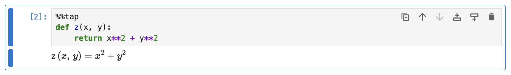
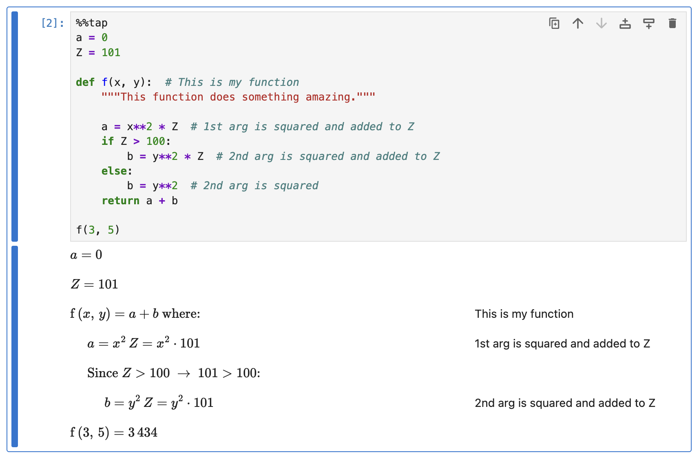
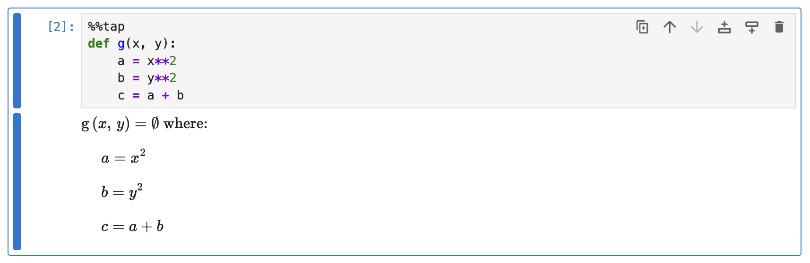
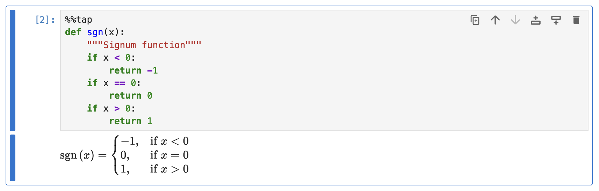

# Function Definitions

This guide demonstrates how Rubberize renders function definitions.

A very simple function definition is rendered by Rubberize like so:

```python
%%tap
def z(x, y):
    return x**2 + y**2
```

<picture>
    <source media="(prefers-color-scheme: dark)" srcset="../assets/rendering/funcdefs/simple_funcdef_dark.png">
    <source media="(prefers-color-scheme: light)" srcset="../assets/rendering/funcdefs/simple_funcdef.png">
    
</picture>

## Multiple-statement Functions

If the function definition has multiple statements within its block, it will be handled like so:

```python
%%tap
a = 0
Z = 101

def f(x, y):  # This is my function
    """This function does something amazing."""
    
    a = x**2 * Z  # 1st arg is squared and added to Z
    if Z > 100:
        b = y**2 * Z  # 2nd arg is squared and added to Z
    else:
        b = y**2  # 2nd arg is squared
    return a + b

f(3, 5)
```

<picture>
    <source media="(prefers-color-scheme: dark)" srcset="../assets/rendering/funcdefs/funcdef_dark.png">
    <source media="(prefers-color-scheme: light)" srcset="../assets/rendering/funcdefs/funcdef.png">
    
</picture>

As seen from the example, Rubberize skips rendering for function docstrings. Similar to a basic function definition, the return statement is placed on the introductory expression as equal to the function signature. However, this time it will be followed by "$\text{where}$".

> [!NOTE]
> Rubberize can only handle function definitions with **a single return statement as the last line** of the block, or **[piecewise functions](#piecewise-functions)**.

Moreover, variables within the scope of the function definition (`x`, `y`, `a`, and `b`) are not substituted, even if `a` has a value in the global scope. `Z` however, is substituted since it is only *referenced* from the global scope.

## Functions that Return `None`

If there is no last `return` statement or `return None` is explicitly written, Rubberize will show that the function is equal to an *empty set* ($\emptyset$).

```python
%%tap
def g(x, y):
    a = x**2
    b = y**2
    c = a + b
```

<picture>
    <source media="(prefers-color-scheme: dark)" srcset="../assets/rendering/funcdefs/funcdef_ret_none_dark.png">
    <source media="(prefers-color-scheme: light)" srcset="../assets/rendering/funcdefs/funcdef_ret_none.png">
    
</picture>

## Piecewise Functions

Multiple `return` statements are only allowed by Rubberize when the function definition follows a piecewise format, which is a function definition that only contains **at least one** conditional ladder and an optional last return statement. The following formats are accepted:

<table>
<tr>
<td> Recommended format. </td>
<td> Without a final return is also acceptable. Just make sure that all conditions are covered so that the function doesn't return <code>None</code>. </td>
<td> Also acceptable, but note that <code>elif</code> and <code>else</code> are unnecessary. See <a href="https://pylint.readthedocs.io/en/latest/user_guide/messages/refactor/no-else-return.html">this Pylint message</a>. </td>
</tr>
<tr style="vertical-align:top;">
<td>

```python
%%tap
def a(x):
    if x < 0:
        return 1
    if 0 < x <= 1:
        return 2
    return 3
```

</td>
<td>
    
```python
%%tap
def a(x):
    if x < 0:
        return 1
    if 0 < x <= 1:
        return 2
    if x > 1:
        return 3
```

</td>
<td>

```python
%%tap
def a(x):
    if x < 0:
        return 1
    elif 0 < x <= 1:
        return 2
    else:
        return 3
```

</td>
</tr>
</table> 

As an example, this is an implementation of the [sign function](https://en.wikipedia.org/wiki/Sign_function) in Python:

```python
%%tap
def sgn(x):
    """Signum function"""
    if x < 0:
        return -1
    if x == 0:
        return 0
    if x > 0:
        return 1
```

<picture>
    <source media="(prefers-color-scheme: dark)" srcset="../assets/rendering/funcdefs/signum_dark.png">
    <source media="(prefers-color-scheme: light)" srcset="../assets/rendering/funcdefs/signum.png">
    
</picture>

## What's Next?

Go back to [Expression and Statement Rendering](index.md) index to look at how other elements are rendered.