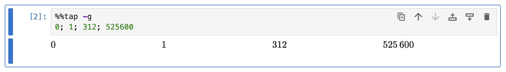
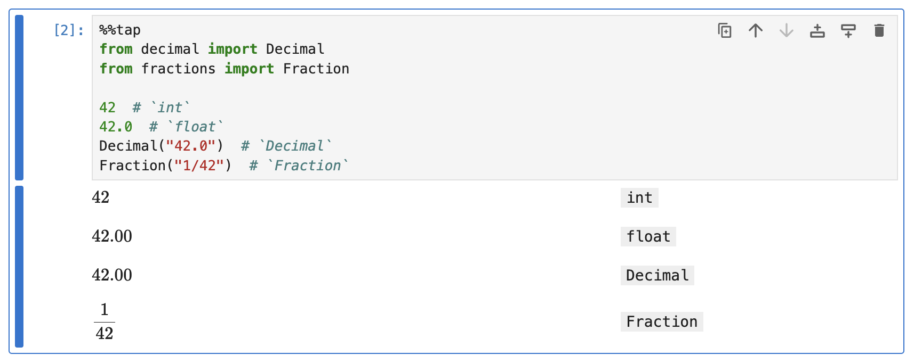
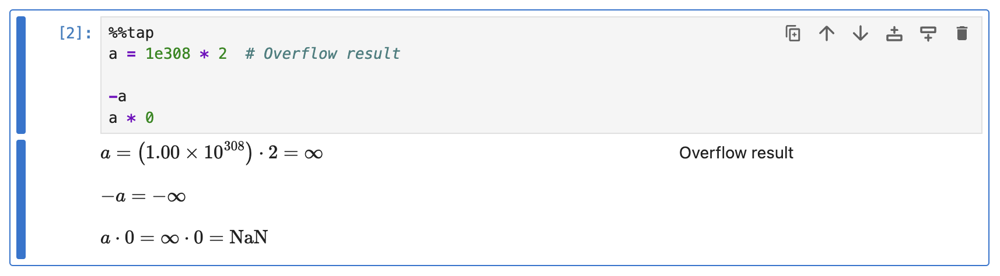
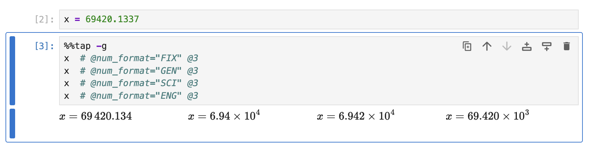
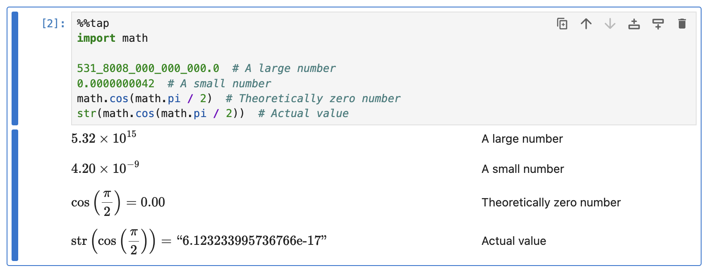
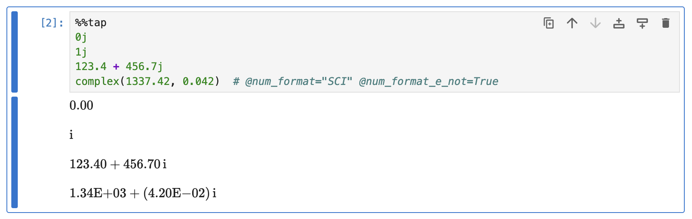
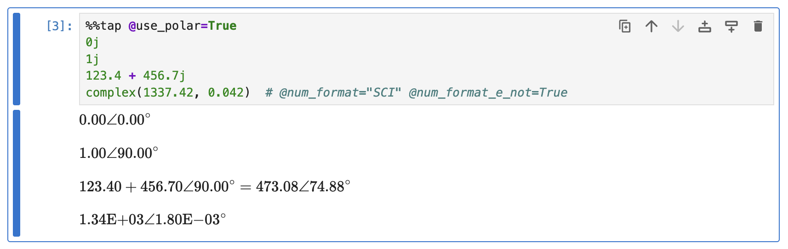

# Numbers

This guide demonstrates how Rubberize renders various types of numbers, including integers, real numbers, and complex numbers, with customizable formatting options for separators, precision, and notation.

## Integers

Integers are whole numbers and are represented as such.

```python
%%tap -g
0; 1; 312; 525600
```

<picture>
    <source media="(prefers-color-scheme: dark)" srcset="../assets/rendering/numbers/integers_dark.png">
    <source media="(prefers-color-scheme: light)" srcset="../assets/rendering/numbers/integers.png">
    
</picture>

### Thousands Separator

By default, numbers are divided in groups of three using a thin space to facilitate reading.[^1]

You can change the grouping separator by setting the `@thousands_separator` config option (a `str`, default is `" "`), to any of these values:

| Separator            | `@thousands_separator=` | Rendered as      |
|----------------------|-------------------------|------------------|
| None                 | `""`                    | $525600$         |
| Thin space (default) | `" "`                   | $525\ 600$       |
| Comma                | `","`                   | $525{,}600$      |
| Dot                  | `"."`                   | $525.600$        |
| Apostrophe           | `"'"`                   | $525\text{’}600$ |

## Real Numbers

A real number is distinguished from an integer by including a decimal point (to make it a `float`), by instantiating it as a `Decimal` from the `decimal` module, or by instantiating it as a `Fraction` from the `fractions` module.

```python
%%tap
from decimal import Decimal
from fractions import Fraction

42  # `int`
42.0  # `float`
Decimal("42.0")  # `Decimal`
Fraction("1/42")  # `Fraction`
```

<picture>
    <source media="(prefers-color-scheme: dark)" srcset="../assets/rendering/numbers/real_numbers_dark.png">
    <source media="(prefers-color-scheme: light)" srcset="../assets/rendering/numbers/real_numbers.png">
    
</picture>

### Infinity and NaN

Infinity and Not a Number values are rendered:

```python
%%tap
a = 1e308 * 2  # Overflow result

-a
a * 0
```

<picture>
    <source media="(prefers-color-scheme: dark)" srcset="../assets/rendering/numbers/special_values_dark.png">
    <source media="(prefers-color-scheme: light)" srcset="../assets/rendering/numbers/special_values.png">
    
</picture>

### Number Formats

For `float` and `Decimal` types, you can format the appearance of values using the `@num_format` config option (a `str`, default is `"FIX"`), to any of these values:

| Number Format                  | Explanation                                                                                | `@num_format=` | Rendered as<br>(with `@num_format_prec=3`) |
|--------------------------------|--------------------------------------------------------------------------------------------|----------------|--------------------------------------------|
| Fixed-point notation (default) | Displays the number as-is with a fixed number of decimals.                                 | `"FIX"`        | $69\ 420.134$                              |
| General notation               | Automatically switches between fixed-point and scientific notation based on value size.    | `"GEN"`        | $6.94 \times 10^{4}$                       |
| Scientific notation            | Represents the number in scientific notation with a single digit before the decimal point. | `"SCI"`        | $6.942 \times 10^{4}$                      |
| Engineering notation           | Similar to scientific notation but uses exponents that are multiples of three.             | `"ENG"`        | $69.420 \times 10^{3}$                     |

```python
x = 69420.1337
```

```python
%%tap -g
x  # @num_format="FIX" @3
x  # @num_format="GEN" @3
x  # @num_format="SCI" @3
x  # @num_format="ENG" @3
```

<picture>
    <source media="(prefers-color-scheme: dark)" srcset="../assets/rendering/numbers/number_formats_dark.png">
    <source media="(prefers-color-scheme: light)" srcset="../assets/rendering/numbers/number_formats.png">
    
</picture>

### E notation

For general, scientific, and engineering notations, you can enable E notation by setting the `@num_format_e_not` config option to `True`. This will render numbers in the form $6.942\mathrm{E}{+4}$ instead of $6.942 \times 10^{4}$.

### Format Precision

You can change the displayed precision using the `@num_format_prec` config option (an `int`, default is `2`). If `@num_format="FIX"`, `@num_format_prec` is the **number of decimal digits** to be displayed. Otherwise, it is the **number of significant figures** to be displayed.

Shortcut keywords for setting the format precision are `@0`, `@1`, ..., `@6`.

> [!note]
> The config option `@num_format_prec` only controls how numbers are formatted, not how they are computed. Even if you format a number to show only, say, 2 decimal places, Python still retains all extra digits internally.

### Thousands Separator

Real numbers also use the thousands separator set by `@thousands_separator` as explained [above](#thousands-separator).

### Decimal Marker

The config option `@decimal_marker` (a `str`, default is `"."`), can be used to specify the decimal marker. In accordance with BIPM,[^2] Decimal markers can be:

| Decimal Marker | `@decimal_marker=` | Rendered as      |
|----------------|--------------------|------------------|
| Dot (default)  | `"."`              | $1\ 069.42$      |
| Comma          | `","`              | $1\ 069{,}42$    |

### Large and Small Numbers

The following rules are applied when using fixed-point notation (`@num_format="FIX"`):

- **Large numbers**: Numbers with more digits than the value set by `@num_format_max_digits` (an `int`, default is `15`) will automatically switch to scientific notation for readability. It's worth noting that integers do not follow this behavior.

- **Small numbers**: If the number of decimal digits after rounding is less than the precision specified by `@num_format_prec`, the number will also be formatted in scientific notation.

- **For very small numbers close to zero**: If the absolute value is less than `@zero_float_threshold` (a `float`, default is `1e-12`), it will be rendered as zero. This behavior accounts for floating-point precision errors in computations, such as those involving trigonometric functions.

```python
%%tap
import math

531_8008_000_000_000.0  # A large number
0.0000000042  # A small number
math.cos(math.pi / 2)  # Theoretically zero number
str(math.cos(math.pi / 2))  # Actual value
```

<picture>
    <source media="(prefers-color-scheme: dark)" srcset="../assets/rendering/numbers/large_small_numbers_dark.png">
    <source media="(prefers-color-scheme: light)" srcset="../assets/rendering/numbers/large_small_numbers.png">
    
</picture>

## Complex Numbers
Python uses `j` as the imaginary unit for `complex`, but Rubberize uses the standard $\mathrm{i}$ notation. Formatting rules for [real numbers](#real-numbers) also apply to both real and imaginary parts of a complex number.

If the complex number is `1j`, it is rendered as the imaginary unit $\mathrm{i}$. If the complex number is `0j`, it is rendered as zero.

```python
%%tap
0j
1j
123.4 + 456.7j
complex(1337.42, 0.042)  # @num_format="SCI" @num_format_e_not=True
```

<picture>
    <source media="(prefers-color-scheme: dark)" srcset="../assets/rendering/numbers/complex_dark.png">
    <source media="(prefers-color-scheme: light)" srcset="../assets/rendering/numbers/complex.png">
    
</picture>

### Polar form

To automatically render complex numbers in polar form, set `@use_polar` config option (a `bool`, default is `False`) to `True`.

```python
%%tap @use_polar=True
0j
1j
123.4 + 456.7j
complex(1337.42, 0.042)  # @num_format="SCI" @num_format_e_not=True
```

<picture>
    <source media="(prefers-color-scheme: dark)" srcset="../assets/rendering/numbers/complex_polar_dark.png">
    <source media="(prefers-color-scheme: light)" srcset="../assets/rendering/numbers/complex_polar.png">
    
</picture>

To render phase angles in radians, set `@use_polar_deg` config option (a `bool`, default is `True`) to `False`.

## What's Next?

* Go to [Physical Quantities (Pint)](pint.md) rendering guide to look at how numbers with units are rendered.
* Go back to [Expression and Statement Rendering](index.md) index to look at how other elements are rendered.

[^1]: CGPM, "Resolution 7 of the 9th General Conference on Weights and Measures (1948)," Bureau International des Poids et Mesures (BIPM). Available: https://www.bipm.org/en/committees/cg/cgpm/9-1948/resolution-7
[^2]: CGPM, "Resolution 10 of the 22nd General Conference on Weights and Measures (2003)," Bureau International des Poids et Mesures (BIPM). Available: https://www.bipm.org/en/committees/cg/cgpm/22-2003/resolution-10