# Arrays

The rendering of NumPy's *n*-dimensional array type is supported by Rubberize. This guide demonstrates how Rubberize renders this type.

> [!NOTE]
> Familiarity with **NumPy** is recommended for this guide. Learn more about NumPy [here](https://numpy.org/doc/stable/).

## Rendering Arrays

Users of NumPy would typically import it as `np`:

```python
import numpy as np
```

To create an array, you would use `np.array()`:

> [!TIP]
> For mathematical presentation, use the naming convention `..._mat` to render the variable in bold, as in textbooks.

```python
%%tap -g
a_mat = np.array([1, 2, 3, 4])
b_mat = np.array([[1, 2], [3, 4]])
c_mat = np.array([[[1, 2], [3, 4]], [[5, 6], [7, 8]]])
```

<picture>
    <source media="(prefers-color-scheme: dark)" srcset="../assets/rendering/numpy/numpy_array_dark.png">
    <source media="(prefers-color-scheme: light)" srcset="../assets/rendering/numpy/numpy_array.png">
    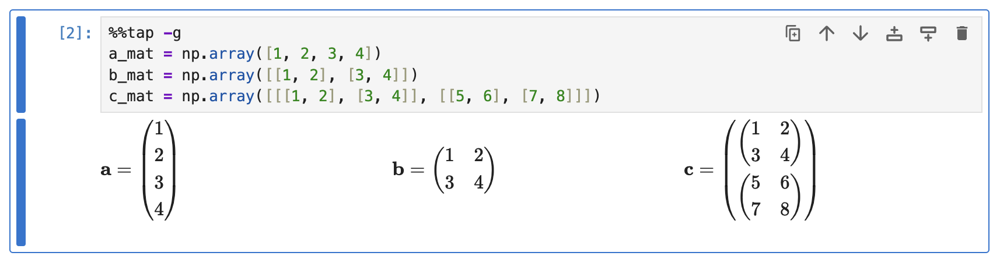
</picture>

Other array creation routines are also supported by Rubberize:

### Identity Array

```python
%%tap
A_mat = np.eye(2,3,1)
B_mat = np.identity(2)
```

<picture>
    <source media="(prefers-color-scheme: dark)" srcset="../assets/rendering/numpy/identity_dark.png">
    <source media="(prefers-color-scheme: light)" srcset="../assets/rendering/numpy/identity.png">
    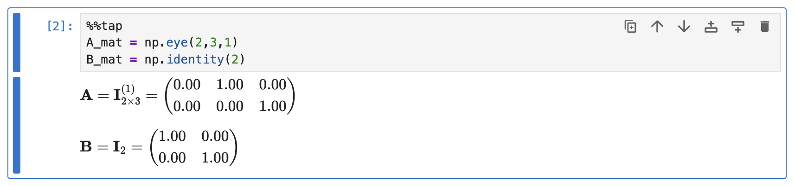
</picture>

### Array with Ones or Zeros

```python
%%tap
C_mat = np.ones((3,2)) 
C_mat_star = np.ones(3)
D_mat = np.ones_like(B_mat)
E_mat = np.zeros((3,2))
E_mat_star = np.zeros(2)
F_mat = np.zeros_like(A_mat)
```

<picture>
    <source media="(prefers-color-scheme: dark)" srcset="../assets/rendering/numpy/ones_zeros_dark.png">
    <source media="(prefers-color-scheme: light)" srcset="../assets/rendering/numpy/ones_zeros.png">
    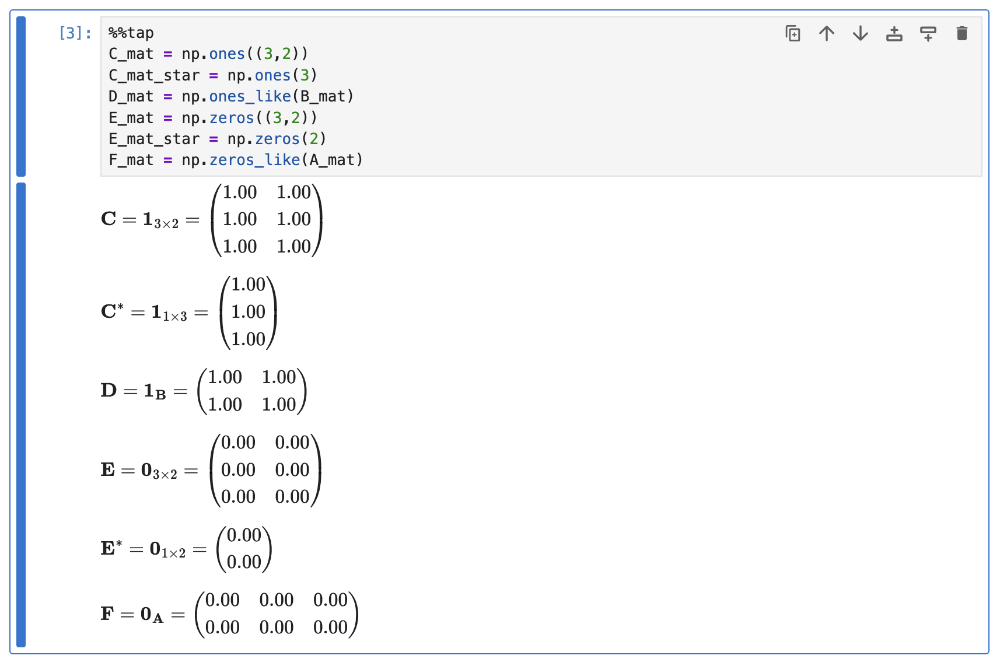
</picture>

### Array with Fill Value

```python
%%tap
G_mat = np.full((2,1), 69.0)
H_mat = np.full_like(E_mat, 420.0)
```

<picture>
    <source media="(prefers-color-scheme: dark)" srcset="../assets/rendering/numpy/full_dark.png">
    <source media="(prefers-color-scheme: light)" srcset="../assets/rendering/numpy/full.png">
    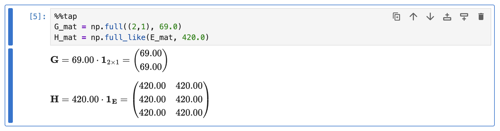
</picture>

## Accessing Elements

Access NumPy array elements similar to other collection types:

```python
%%tap
b_mat = np.array([[1, 2], [3, 4]])
b_mat[0][1]
b_mat[0, 1]  # More efficient access
```

<picture>
    <source media="(prefers-color-scheme: dark)" srcset="../assets/rendering/numpy/array_elt_access_dark.png">
    <source media="(prefers-color-scheme: light)" srcset="../assets/rendering/numpy/array_elt_access.png">
    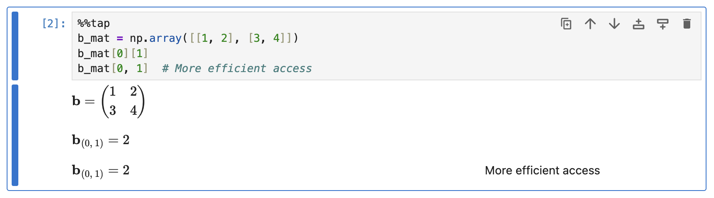
</picture>

## Rendering Operations

Common NumPy array operations are supported:

### Arithmetic Operations

```python
%%tap
a_mat = np.array([[1, 2], [3, 4]])
b_mat = np.array([[5, 6], [7, 8]])

a_mat + b_mat
a_mat * b_mat
a_mat / b_mat
```

<picture>
    <source media="(prefers-color-scheme: dark)" srcset="../assets/rendering/numpy/arithmetic_op_dark.png">
    <source media="(prefers-color-scheme: light)" srcset="../assets/rendering/numpy/arithmetic_op.png">
    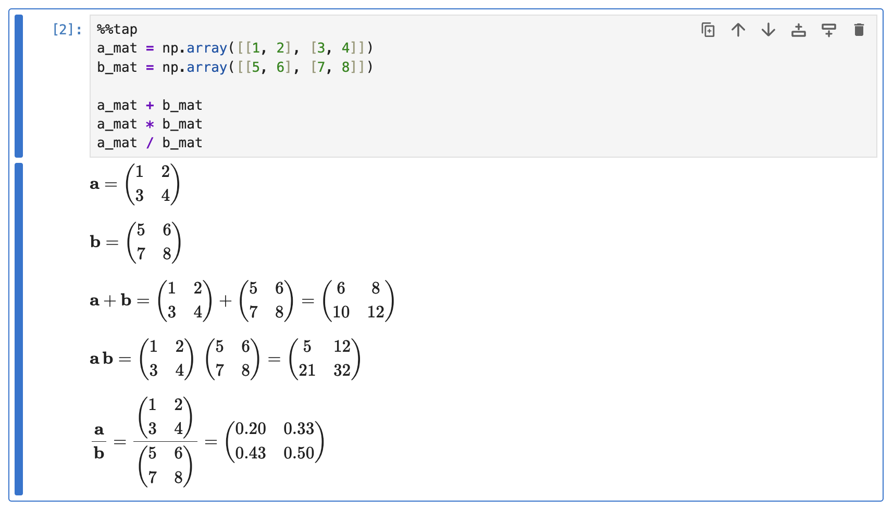
</picture>

### Scalar Operations

```python
%%tap
c_mat = np.array([[9, 10], [11, 12]])

1 + b_mat
2 * b_mat
3 / b_mat
```

<picture>
    <source media="(prefers-color-scheme: dark)" srcset="../assets/rendering/numpy/scalar_op_dark.png">
    <source media="(prefers-color-scheme: light)" srcset="../assets/rendering/numpy/scalar_op.png">
    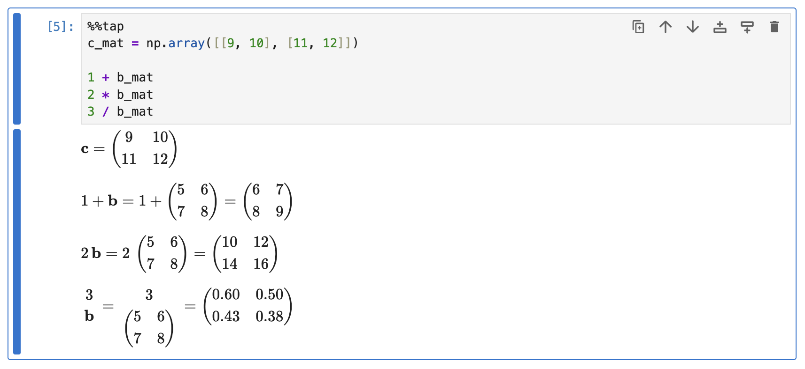
</picture>

### Matrix Multiplication

Matrix multiplication in Python is done using the `@` symbol:

```python
%%tap
d_mat = np.array([[13, 14], [15, 16]])
e_mat = np.array([[17, 18], [19, 20]])

d_mat @ e_mat
```

<picture>
    <source media="(prefers-color-scheme: dark)" srcset="../assets/rendering/numpy/matmult_dark.png">
    <source media="(prefers-color-scheme: light)" srcset="../assets/rendering/numpy/matmult.png">
    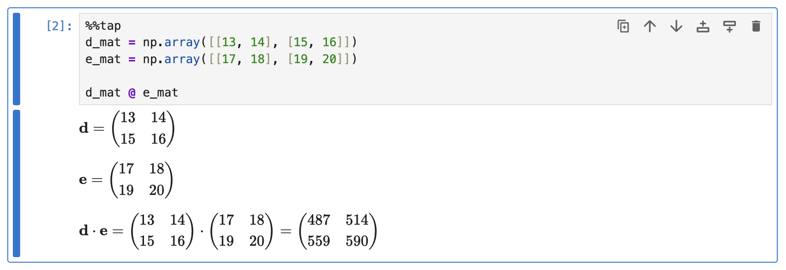
</picture>

Matrix multiplication always uses a center dot ($\cdot$) as the multiplication symbol.

### Cross Product

```python
%%tap
Q_mat = np.array([[1, 2, 3], [4, 5, 6]])
W_mat = np.array([[7, 8, 9], [10, 11, 12]])
E_mat = np.array([[7, 8, 9], [10, 11, 12]])

np.cross(Q_mat, W_mat)
np.cross(np.cross(Q_mat, W_mat), E_mat)
np.cross(Q_mat, np.cross(W_mat, E_mat))
```

<picture>
    <source media="(prefers-color-scheme: dark)" srcset="../assets/rendering/numpy/crossmult_dark.png">
    <source media="(prefers-color-scheme: light)" srcset="../assets/rendering/numpy/crossmult.png">
    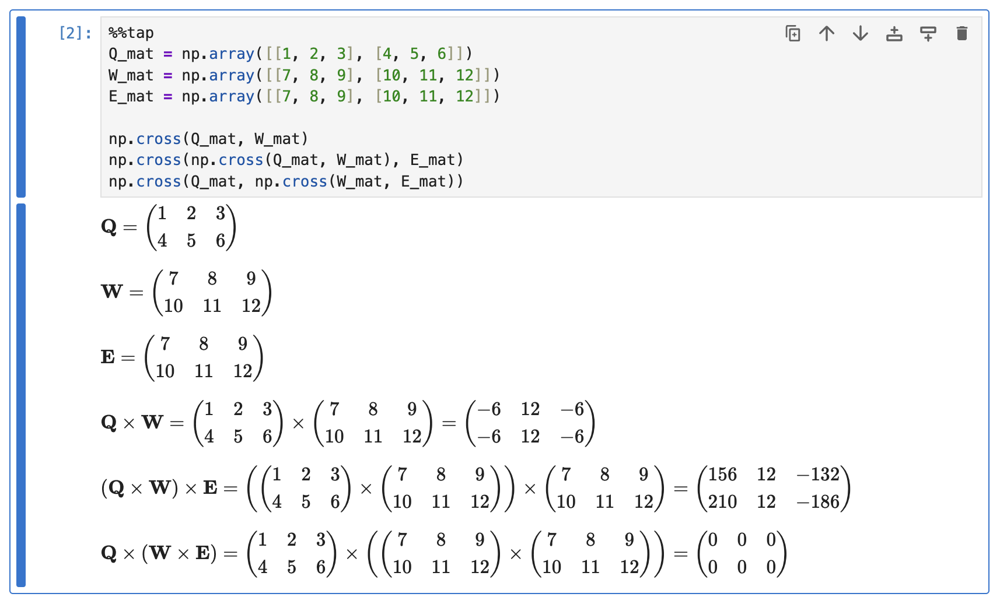
</picture>

Associativity rules are considered for cross product rendering.

### Transpose

```python
%%tap
a_mat = np.array([[1., 2], [3, 4]])
a_mat.transpose()
np.transpose(a_mat)
a_mat.T  # Partially supported
```

<picture>
    <source media="(prefers-color-scheme: dark)" srcset="../assets/rendering/numpy/transpose_dark.png">
    <source media="(prefers-color-scheme: light)" srcset="../assets/rendering/numpy/transpose.png">
    
</picture>

### Linear Algebra Operations

```python
%%tap
R_mat = np.array([[13, 14], [15, 16]])

np.linalg.det(R_mat)
np.linalg.matrix_rank(R_mat)
np.linalg.matrix_power(3 * R_mat, 3)
np.linalg.inv(R_mat)
np.linalg.pinv(R_mat)
```

<picture>
    <source media="(prefers-color-scheme: dark)" srcset="../assets/rendering/numpy/linalg_op_dark.png">
    <source media="(prefers-color-scheme: light)" srcset="../assets/rendering/numpy/linalg_op.png">
    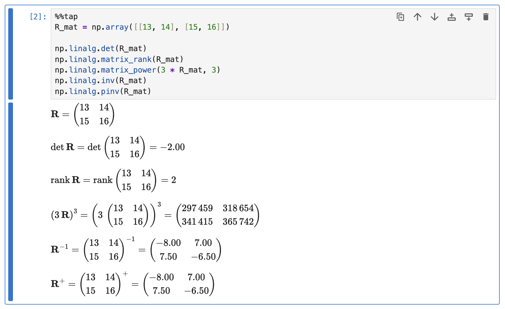
</picture>

### Solving Systems of Equations

```python
%%tap
# **Define stiffness matrix**
k_1, k_2, k_3 = 10, 15, 20  # Example stiffness values
K_mat = np.array([[k_1 + k_2, -k_2],
              [-k_2, k_2 + k_3]])

# **Force vector**
F_mat = np.array([100, 150])  # Example forces

u_mat = np.linalg.inv(K_mat) @ F_mat  # Solve for displacements
u_mat_alt = np.linalg.solve(K_mat, F_mat)  # Alternative using `linalg.solve()` @line
```

<picture>
    <source media="(prefers-color-scheme: dark)" srcset="../assets/rendering/numpy/stiffness_dark.png">
    <source media="(prefers-color-scheme: light)" srcset="../assets/rendering/numpy/stiffness.png">
    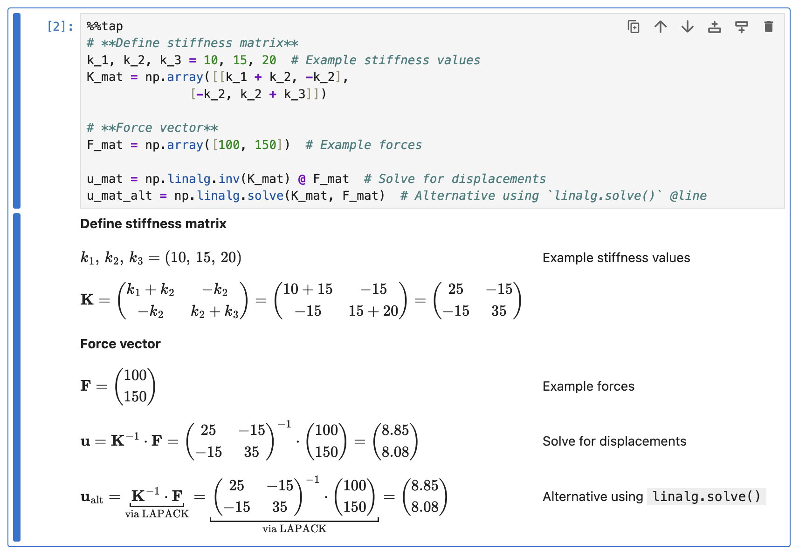
</picture>

## What's Next?

* Go back to [Expression and Statement Rendering](index.md) index to look at how other elements are rendered.
