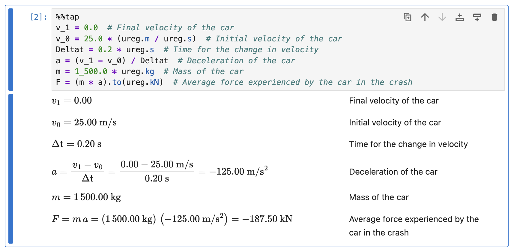
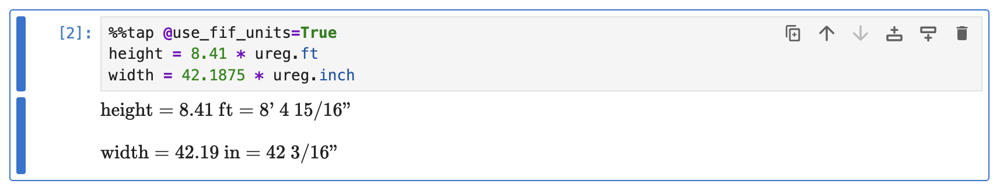
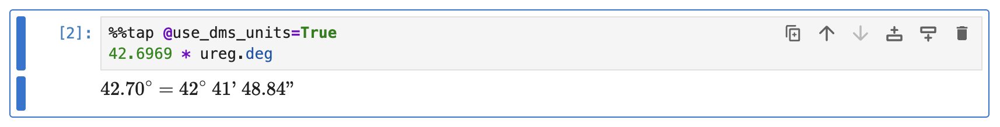
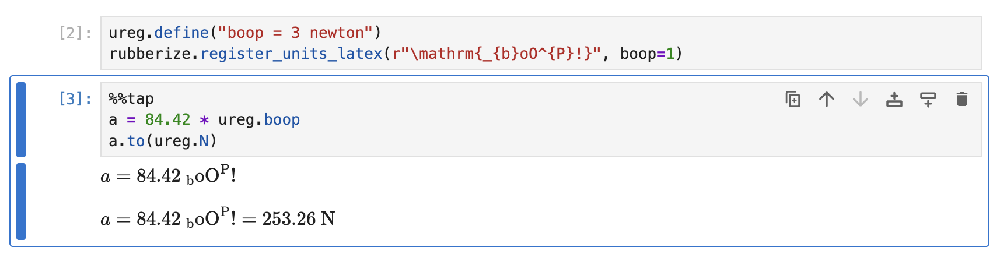

# Physical Quantities (Pint)

Pint's physical quantity types, which encapsulate numbers with units, are fully integrated into Rubberize. This guide demonstrates how Rubberize renders these quantities.

Unit-aware calculations help ensure accuracy and consistency in computations by explicitly associating numerical values with their respective units. This reduces the risk of errors caused by unit mismatches. Pint is one of the most widely used tools in Python for working with units.

> [!NOTE]
> Familiarity with **Pint** is recommended for this guide. Pint is a powerful library widely used by engineers and scientists. [Learn more about Pint here](https://pint.readthedocs.io/en/stable/index.html).

## Rendering Quantities

To use Pint, import it and instantiate a `UnitRegistry`:

```python
import pint

# Instantiate a UnitRegistry
ureg = pint.UnitRegistry()
```

In the subsequent cells using `%%tap`, you can simply use the `UnitRegistry` instance to assign units to your variables. Rubberize heuristically recognizes when you intend to apply units, making the process seamless.

```python
%%tap
v_1 = 0.0  # Final velocity of the car
v_0 = 25.0 * (ureg.m / ureg.s)  # Initial velocity of the car
t = 0.2 * ureg.s  # Time for the change in velocity
a = (v_1 - v_o) / t  # Deceleration of the car
m = 1_500.0 * ureg.kg  # Mass of the car
F = (m * a).to(ureg.kN)  # Average force experienced by the car in the crash
```

<picture>
    <source media="(prefers-color-scheme: dark)" srcset="../assets/rendering/pint/pint_dark.png">
    <source media="(prefers-color-scheme: light)" srcset="../assets/rendering/pint/pint.png">
    
</picture>

Unit assignments are rendered with a small space (`\ ` in LaTeX) between the quantity value and the unit symbols. All unit symbols are in upright Roman font, in accordance with CGPM.[^1]

When quantities are multiplied, they are wrapped in parentheses, following one of the recommendations of the SI Brochure.[^2]

### Converting to Other Units

As shown in the last line of the example above, a `Quantity` object's `to()` or `ito()` methods calls are hidden by Rubberize, allowing you to present unit conversions as an equality.

## Units Rendering Enhancements

Rubberize enhances the default LaTeX rendering provided by Pint, offering improved formatting:

- Units are multiplied implicitly (using a thin space) instead of using a center dot to match Rubberize rules for multiplication of expressions. This setting is controlled by `@use_contextual_mult` config option (a `bool`, default is `True`) for all, including normal expression multiplication operations.

- Fractions are rendered as inline units using a solidus ($a/b$) instead of a fraction ($\frac{a}{b}$) for a more compact but readable appearance. If the fraction has multiple denominator terms, negative exponents will be used instead of a solidus. This setting can be turned off by setting `@use_inline_units` config option (a `bool`, default is `True`) to `False`.

- Angular degree units are rendered as $45.00^{\circ}$ instead of $45.00\ \deg$.

## Foot-Inch-Fraction (FIF) Units

Rubberize supports rendering inch measurements as foot-inch-fraction (FIF) format. This feature is particularly useful for applications in US construction and other fields where fractional inch measurements are standard. To enable this feature, set the `@use_fif_units` config option to `True`.

You can also specify the precision of the fractional part using the `@fif_prec` option. By default, this is set to `16`, representing sixteenths of an inch. 

When enabled:

- Quantities in **feet** are displayed as **Feet-Inches-Fraction**.

- Quantities in **inches** are displayed as **Inches-Fraction**.

```python
%%tap @use_fif_units = True
height = 8.41 * ureg.ft
width = 42.1875 * ureg.inch
```

<picture>
    <source media="(prefers-color-scheme: dark)" srcset="../assets/rendering/pint/fif_dark.png">
    <source media="(prefers-color-scheme: light)" srcset="../assets/rendering/pint/fif.png">
    
</picture>

## Degree-Minute-Second (DMS) Units

Similar to FIF format, Rubberize supports rendering angle measurements as degree-minute-second (DMS) format. To enable this feature, set the `@use_dms_units` config option to `True`.

```python
%%tap @use_dms_units=True
42.6969 * ureg.deg
```

<picture>
    <source media="(prefers-color-scheme: dark)" srcset="../assets/rendering/pint/dms_dark.png">
    <source media="(prefers-color-scheme: light)" srcset="../assets/rendering/pint/dms.png">
    
</picture>

## Custom Unit LaTeX

Rubberize allows you to define custom LaTeX representations for specific unit combinations using the `register_units_latex()` function. This feature is particularly useful for ensuring that units are displayed in a format familiar to your field of study, such as engineering or scientific conventions.

For example, you can register a custom representation for a bending moment (structural engineering), ensuring that the units are displayed as $\dots\ \mathrm{N}\ \mathrm{m}$ instead of $\dots\ \mathrm{m}\ \mathrm{N}$:

```python
from rubberize import register_units_latex

# Register a custom LaTeX representation for bending moment
register_units_latex(r"\mathrm{N} \cdot \mathrm{m}", meter=1, newton=1)
```

In the function above, the units are specified as keyword arguments, where keys are unit names and values are their corresponding exponents. Once registered, Rubberize will automatically use this representation when rendering quantities with the specified unit combination.

The same process can be done for defining LaTeX representations of custom units:

```python
ureg.define("boop = 3 newton")
rubberize.register_units_latex(r"\mathrm{_{b}oO^{P}!}", boop=1)
```

```python
%%tap
a = 84.42 * ureg.boop
a.to(ureg.N)
```


<picture>
    <source media="(prefers-color-scheme: dark)" srcset="../assets/rendering/pint/custom_latex_dark.png">
    <source media="(prefers-color-scheme: light)" srcset="../assets/rendering/pint/custom_latex.png">
    
</picture>

## What's Next?

* Go back to [Expression and Statement Rendering](index.md) index to look at how other elements are rendered.

[^1]: CGPM, "Resolution 10 of the 22nd General Conference on Weights and Measures (2003)," Bureau International des Poids et Mesures (BIPM). Available: https://www.bipm.org/en/committees/cg/cgpm/22-2003/resolution-10

[^2]: BIPM, "The International System of Units (SI)," 9th edition, Section 5.4.6, Bureau International des Poids et Mesures, 2019. Available: https://www.bipm.org/en/publications/si-brochure