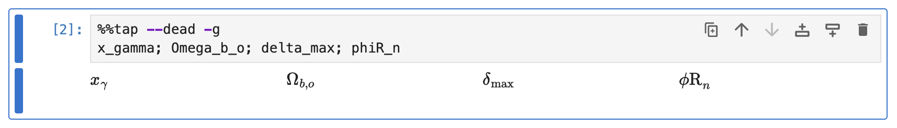
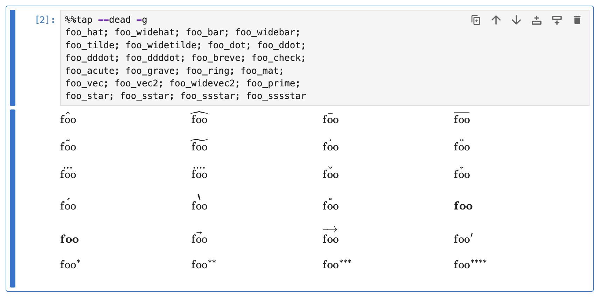

# Variables

This guide demonstrates how Rubberize renders variables, with customizable options on rendering subscripts, greek letters, accents and modifiers.

Python variables are rendered considering the following rules:

- **Single letters** are rendered in italics
- **Multiple letter chain** (i.e., words) appear roman.

```python
%%tap --dead --grid
a; b; x; y;
apple; boy; xylophone; yoyo
```

<picture>
    <source media="(prefers-color-scheme: dark)" srcset="../assets/rendering/variables/variables_dark.png">
    <source media="(prefers-color-scheme: light)" srcset="../assets/rendering/variables/variables.png">
    
</picture>

## Underscores and Subscripts

When `@use_subscripts=True`, the following rules apply:

- **Underscores** are treated as subscripts.
- **Variables with multiple words separated by underscores** (e.g., `scoo_bee_doo`) are rendered with underscores treated as subscripts. Subscripts are not nested; instead, they are displayed as a comma-separated sequence.
- **Two or more consecutive underscores escape the first underscore**. It will be shown as a literal underscore rather than indicating a subscript.
- **Leading and trailing underscores**, commonly used in Python to denote private variables, are not converted to subscripts. If the variable name includes subscripts, the leading and trailing underscores are attached to the base name (not the subscripts).

```python
%%tap --dead --grid
f_o; I_x_male; foo_bulous; foo_a_bravo_c_d
f__o; I__x_male; I_x__male; foo__a_bravo_c__d
_private; __very__private; __double__underscore__; __base_subscript__
```

<picture>
    <source media="(prefers-color-scheme: dark)" srcset="../assets/rendering/variables/subscripts_dark.png">
    <source media="(prefers-color-scheme: light)" srcset="../assets/rendering/variables/subscripts.png">
    
</picture>

### Disabling Subscripts

When `@use_subscripts=False`, all underscores are shown as literal underscores, and variables will be rendered exactly as they are typed but using a Roman font.

## Math Symbols

When `@use_symbols=True`, Greek letters, accents, and modifier keywords are rendered with their proper math symbols. This includes:

### Greek Letters

Python variable name parts that match Greek or Hebrew letter names are replaced with their corresponding symbols. For example, `alpha` becomes $\alpha$, and `Omega` becomes $\Omega$. Note that capital Greek letters resembling Latin letters (e.g., A, B, etc.) are excluded.

```python
%%tap --dead -g
x_gamma; Omega_b_o; delta_max; phiR_n
```

<picture>
    <source media="(prefers-color-scheme: dark)" srcset="../assets/rendering/variables/greek_letters_dark.png">
    <source media="(prefers-color-scheme: light)" srcset="../assets/rendering/variables/greek_letters.png">
    
</picture>

These are all the Greek and Hebrew Letter names that are converted when used. Paste them in a code cell to see each one:

```python
%%tap --dead -g
alpha; beta; Gamma, gamma; Delta, delta
epsilon, varepsilon; zeta; eta; Theta, theta, vartheta
iota; kappa, varkappa; Lambda, lambda_; mu
nu; Xi, xi; omicron; Pi, pi, varpi
rho, varrho; Sigma, sigma, varsigma; tau; Upsilon, upsilon
Phi, phi, varphi; chi; Psi, psi; Omega, omega
digamma; aleph; beth; gimel
```

<picture>
    <source media="(prefers-color-scheme: dark)" srcset="../assets/rendering/variables/greek_letters_all_dark.png">
    <source media="(prefers-color-scheme: light)" srcset="../assets/rendering/variables/greek_letters_all.png">
    
</picture>

Note that due to name conflict with the Python `lambda` statement, `lambda_` can also be used to render a standalone $\lambda$.

### Variables with Starting Greek Letter

Base name parts that start with `Delta`, `gamma`, `phi`, and `psi` will have the Greek letter be rendered (e.g., `DeltaT` becomes $\Delta T$).

This is controlled by the `@greek_starts` config option (a `set`, default is `{"Delta", "gamma", "phi", "psi"}`). To add or remove Greek letters that should be rendered when it appears in the beginning of the base name part, use the functions `config.add_greek_start()` or `config.remove_greek_start()`, respectively.

For example:

```python
config.add_greek_start("Sigma", "Pi")
config.remove_hidden_module("gamma", "phi", "psi")
```

### Accents and Modifiers

Variable names with specific keywords after an underscore (e.g., `_hat`, `_bar`) are rendered with the corresponding accent or modifier. For instance, `x_hat` becomes $\hat{x}$, `S_star` becomes $S^{*}$ and `f_prime` becomes $f'$.

```python
%%tap --dead -g
x_bar; k_hat; f_prime; L_star_a
```

<picture>
    <source media="(prefers-color-scheme: dark)" srcset="../assets/rendering/variables/accents_and_modifiers_dark.png">
    <source media="(prefers-color-scheme: light)" srcset="../assets/rendering/variables/accents_and_modifiers.png">
    
</picture>

These are all the accents and modifiers that can be converted. Paste them in a code cell to see each one:

```python
%%tap --dead -g
foo_hat; foo_widehat; foo_bar; foo_widebar;
foo_tilde; foo_widetilde; foo_dot; foo_ddot;
foo_dddot; foo_ddddot; foo_breve; foo_check;
foo_acute; foo_grave; foo_ring; foo_mat;
foo_vec; foo_vec2; foo_widevec2; foo_prime;
foo_star; foo_sstar; foo_ssstar; foo_sssstar
```

<picture>
    <source media="(prefers-color-scheme: dark)" srcset="../assets/rendering/variables/accents_and_modifiers_all_dark.png">
    <source media="(prefers-color-scheme: light)" srcset="../assets/rendering/variables/accents_and_modifiers_all.png">
    
</picture>

> [!Warning]
> `..._mat` and `..._vec` render similarly. They are not recommended to be used together in a single notebook, to avoid confusion.

### Disabling Symbols

When `@use_symbols=False`, all greek, accent, and modifier keywords will be rendered exactly as they are typed but using a Roman font.

### Attribute Access

Attribute access is rendered the same as you would write it in Python. However, some module names, such as `math`, are skipped from being rendered, leaving only its attributes when displayed by Rubberize:

```python
import math

class Foo:
    def __init__(self):
        self.bar = 42  # Instance attribute
```
```python
%%tap
foo = Foo()
foo.bar  # Attribute access
```

<picture>
    <source media="(prefers-color-scheme: dark)" srcset="../assets/rendering/variables/attribute_access_dark.png">
    <source media="(prefers-color-scheme: light)" srcset="../assets/rendering/variables/attribute_access.png">
    
</picture>

Module names that are skipped are controlled by the `@hidden_modules` config option (a `set`, default is `{"math", "sp", "np", "ureg"}` for `math` module, conventional short names for SymPy and NumPy and Pint `UnitRegistry()` object). To add or remove hidden modules, use the functions `config.add_hidden_module()` or `config.remove_hidden_module()`, respectively.

For example:

```python
config.add_hidden_module("scipy", "foo")
config.remove_hidden_module("np")
```

## What's Next?

Go back to [Expression and Statement Rendering](index.md) index to look at how other elements are rendered.